# ASHA Engine

🚧 Under construction 🚧

**ASHA is a theorem-gated research engine for reconstructing observed physics from a source-typed chain of geometry, algebra, physical filling, and observational transport.**

ASHA is not a list of disconnected formulas. It is a claim-control system. Every result must be classified as one of:

```text
Theorem != Bridge != Physical filling != Diagnostic fit != Unresolved wound
```

The current frontier is the Gate 1349 ledger: a source-typed architecture where the matter/Higgs/scale stack has become highly compressed, while Planck stiffness, the cosmological constant, Majorana phases, and a few native selector principles remain open.


## One-line map

$$\mathcal{O}_{\text{obs}} = \Pi_{\text{obs}} \circ \mathcal{T}_{\text{RG,scheme}} \circ \mathcal{U}_{\text{units}} \circ \mathcal{F}_{\text{fill}} \circ \mathcal{B}_{\text{bridge}}[\mathcal{G}_{\text{ASHA}}]$$ 

Where:

- $\mathcal G_{ASHA}$ is the native finite geometric vessel.
- $\mathcal B_{bridge}$ contains typed bridges that are not yet native theorems.
- $\mathcal F_{fill}$ contains physical filling scales and boundary choices.
- $\mathcal T_{RG,scheme}$ transports boundary values to observed schemes and scales.
- $\Pi_{obs}$ projects the construction into measurable quantities.

The project therefore does **not** claim that every number is already derived from pure geometry. It claims that the chain from geometry to observation is now explicit, layered, falsifiable, and firewalled.

## Visual atlas

The current README-critical figures are programmatically generated using [Penrose](https://github.com/penrose/penrose) from source-typed contracts, not hand-placed drawings.

| Layer | Figure | Source type |
|---|---|---|
| Measurement octave | 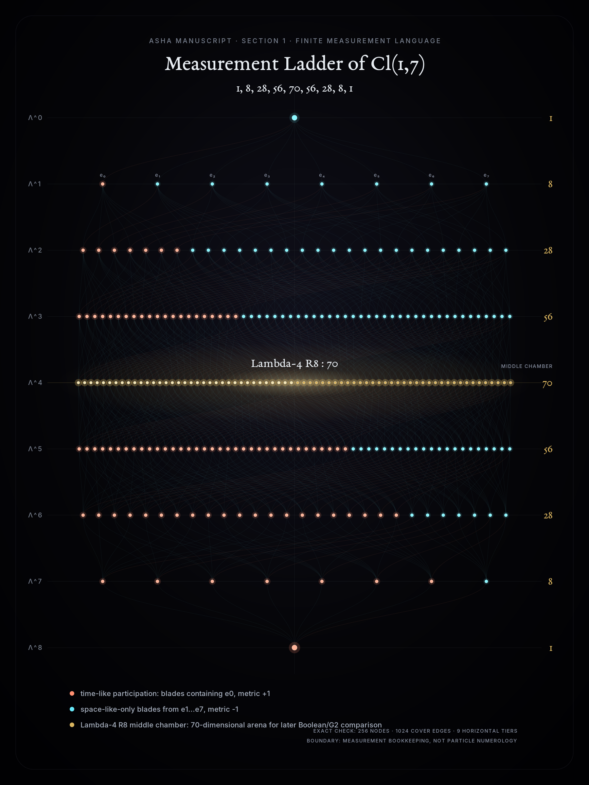 | Exact Pascal-tier Clifford/exterior-grade bookkeeping. |
| Boolean/G2 contact vacuum | 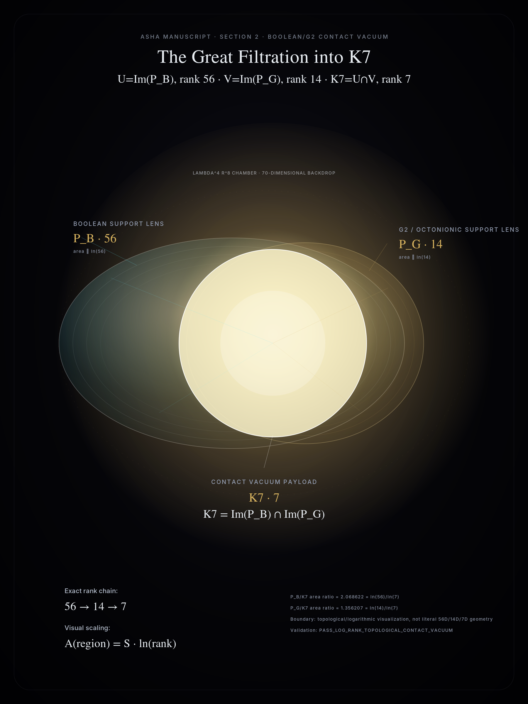 | Exact ranks with logarithmic visual area scaling. |
| Contact depth triple | 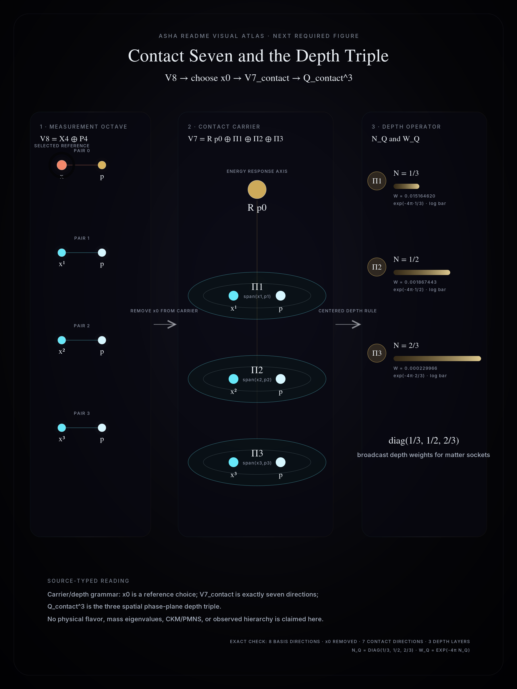 | Exact carrier/depth labels: `V8 -> x0 reference -> V7_contact -> N_Q/W_Q`. |
| Matter sockets/product depth | 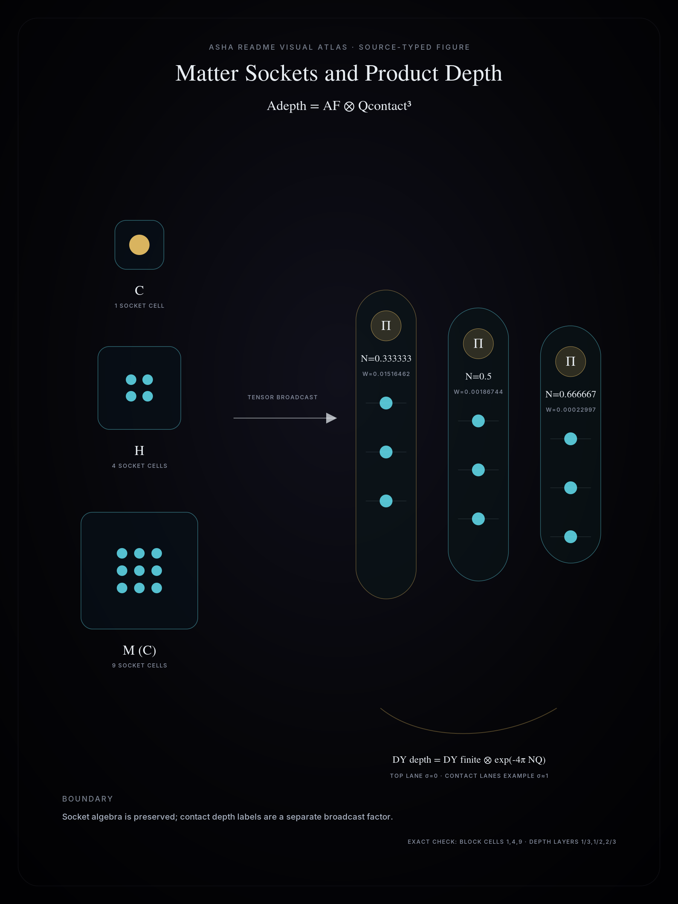 | Exact `A_F` block counts `1,4,9` with contact-depth broadcast `N_Q=(1/3,1/2,2/3)`. |
| Locked source alphabet | 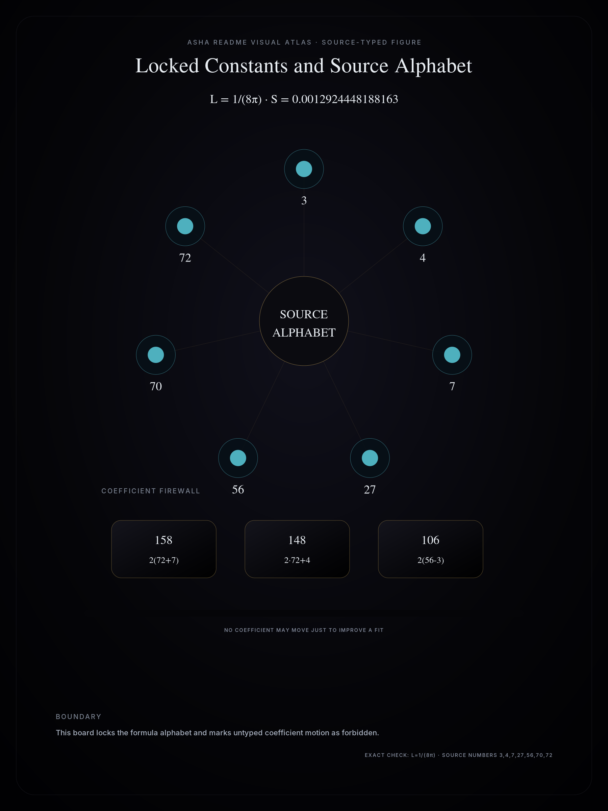 | Locked `L`, `S`, finite source numbers, and coefficient firewall. |
| Scale bridge | 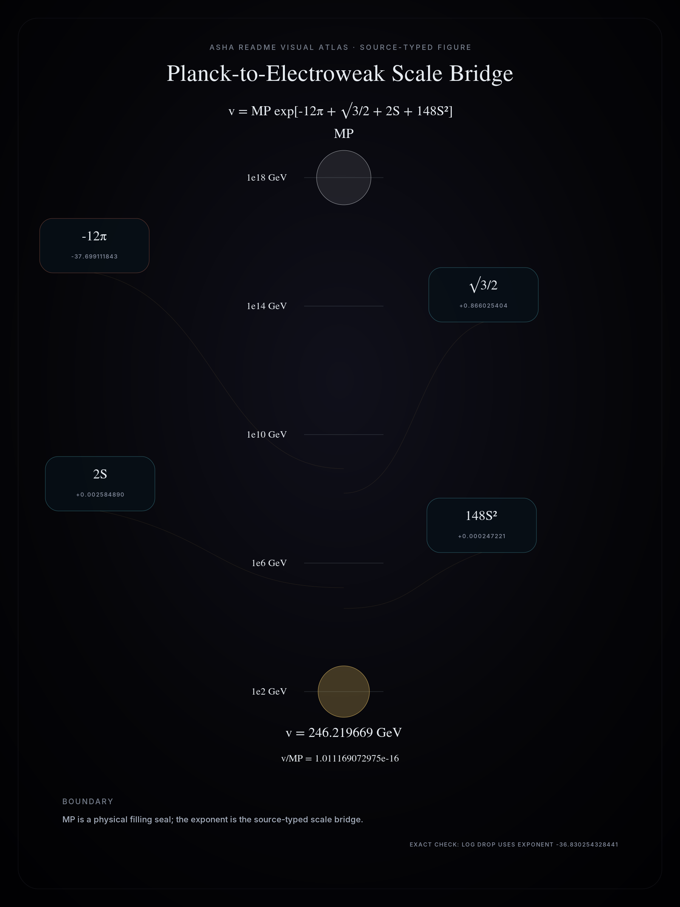 | Exact README exponent visualized as a logarithmic Planck-to-electroweak drop. |
| Higgs sector | 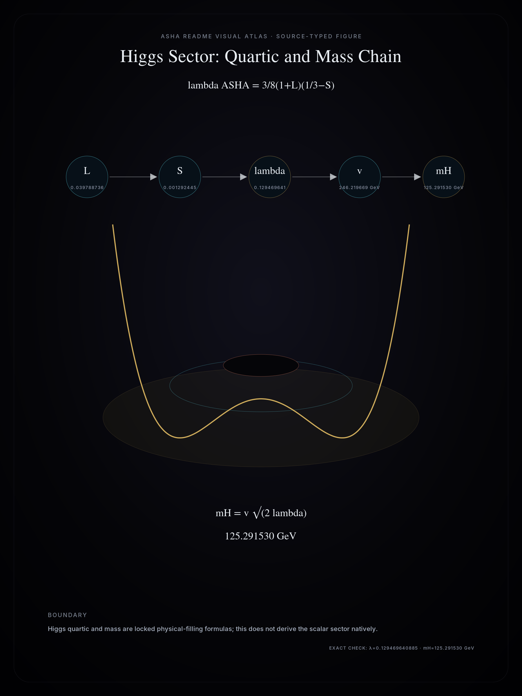 | Exact `lambda_ASHA` and `m_H=v√(2λ)` formula chain. |
| Charged leptons | 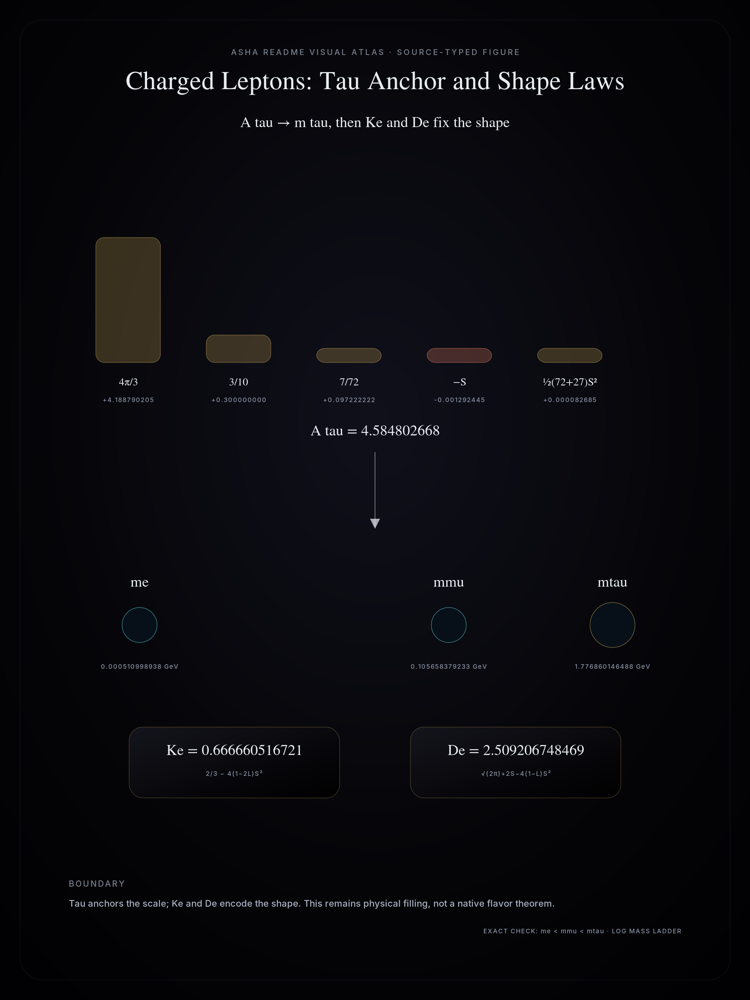 | Exact tau anchor plus `K_e`/`D_e` charged-lepton shape laws. |
| Quarks | 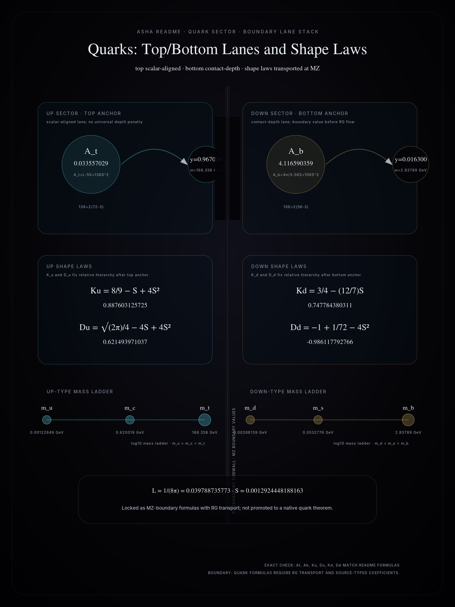 | Exact `A_t`, `A_b`, `K_u`/`D_u`, and `K_d`/`D_d` README formulas; M_Z-boundary/RG-transport firewalled. |
| CKM mixing | 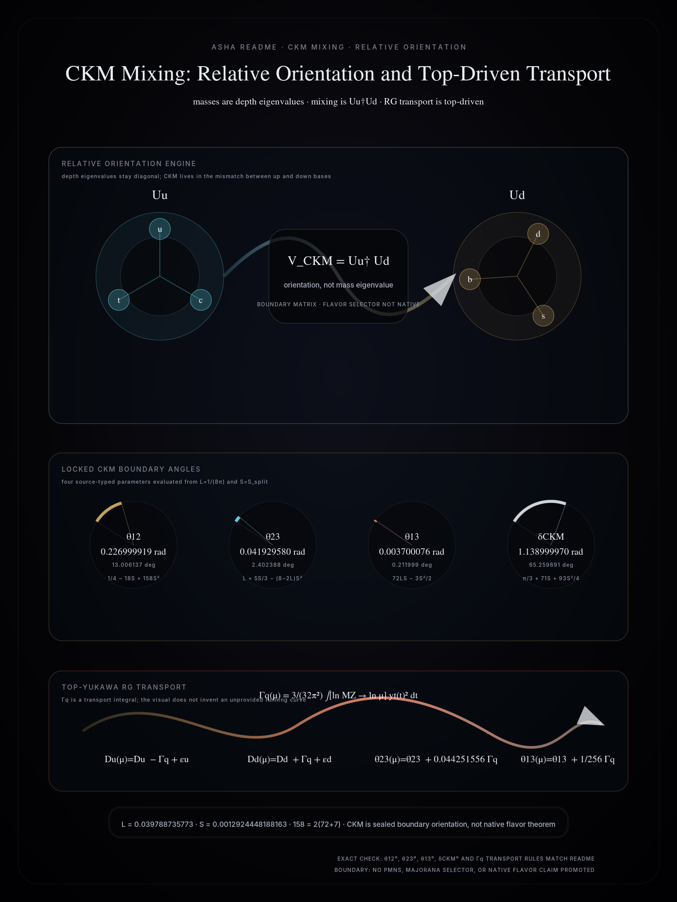 | Exact `V_CKM=U_u†U_d`, locked boundary angles, and symbolic top-Yukawa `Γ_q` RG transport; flavor-selector firewall preserved. |
| Neutrinos | 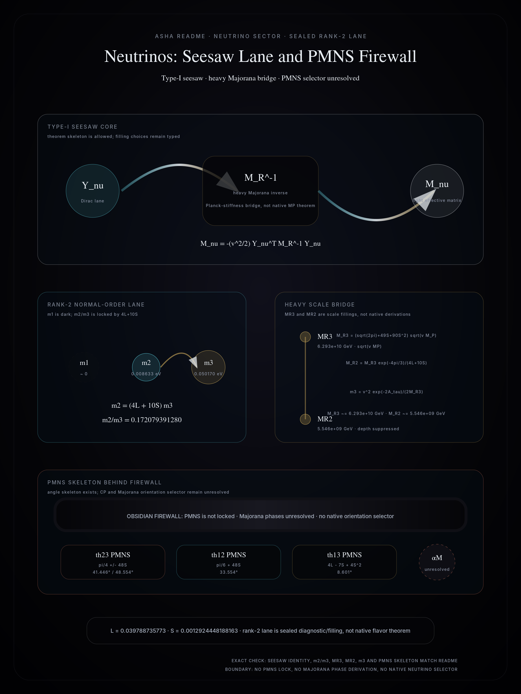 | Exact Type-I seesaw identity, rank-2 normal-order lane, heavy-scale bridge, and PMNS/Majorana firewall preserved. |
| Gravity | 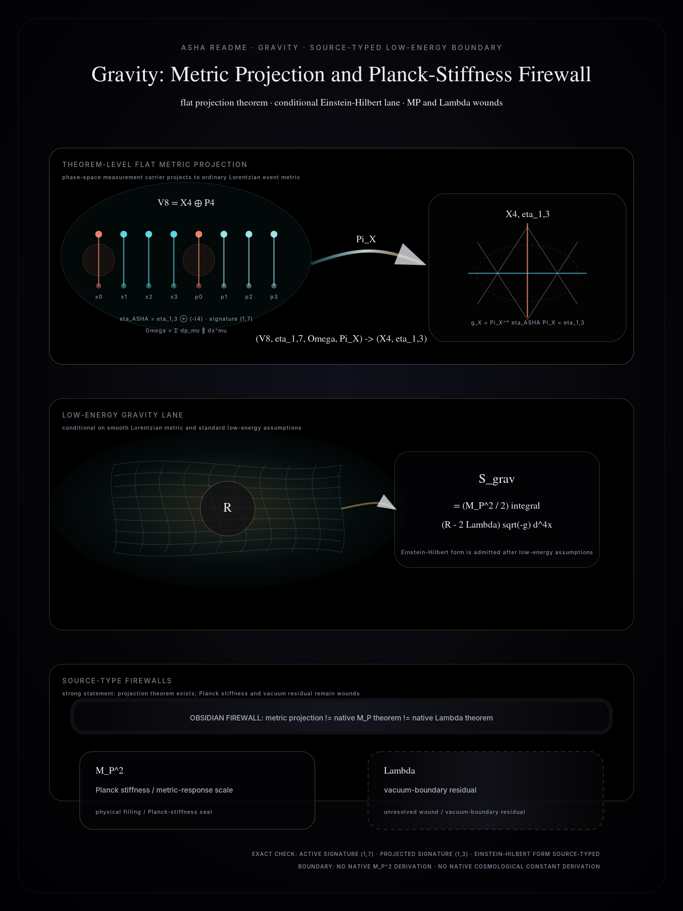 | Exact flat metric projection `(V8,η1,7,Ω,ΠX) -> (X4,η1,3)` plus conditional Einstein-Hilbert lane; `M_P^2` and `Λ` remain firewalled source-type wounds. |
| Low-energy action | 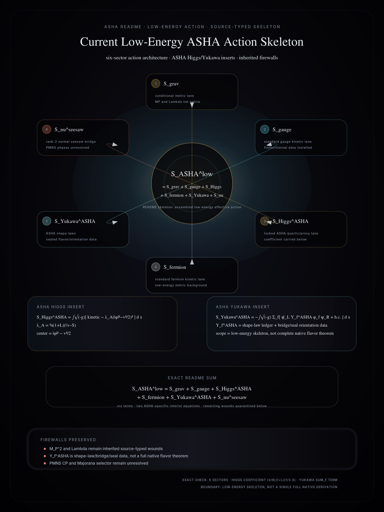 | Exact six-sector README action skeleton with ASHA Higgs/Yukawa insertions and inherited gravity/flavor/PMNS firewalls preserved. |
| Theorem-level stack | 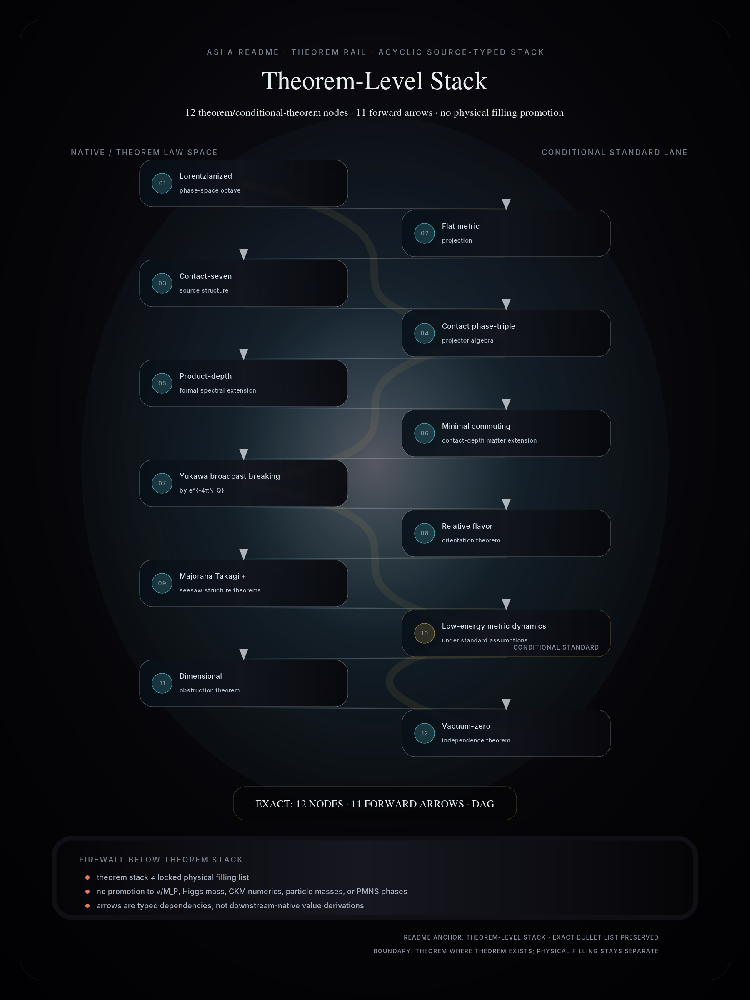 | Exact 12-node acyclic theorem rail with 11 forward arrows; theorem architecture remains separated from physical filling and unresolved wounds. |

---


## The journey from 1

ASHA starts from the scalar identity:

$$
\mathbf 1.
$$

The first carrier is a measurement octave:

$$
V_8=X_4\oplus P_4.
$$

Here $X_4$ is the event/configuration carrier and $P_4$ is the conjugate response/action carrier. This is not eight ordinary spatial dimensions. It is phase-space-like measurement reality: spacetime plus momentum/action response.

The active metric is Lorentzianized:

$$
\eta_{\text{ASHA}} = \eta_{1,3} \oplus (-I_4), \qquad \text{sig}(\eta_{\text{ASHA}}) = (1,7).
$$

With:

$$
\Omega=\sum_{\mu=0}^3 dp_\mu\wedge dx^\mu,
$$

ASHA obtains one hyperbolic time-energy pair and three elliptic spatial phase pairs:

$$J_{\eta}^2 = +1 \text{ on } (x^0,p_0), \qquad J_{\eta}^2 = -1 \text{ on } (x^i,p_i), \quad i=1,2,3.$$ 

Projection to the event carrier gives flat spacetime:

$$
g_X=\Pi_X^\ast\eta_{ASHA}\Pi_X=\eta_{1,3}.
$$

In words:

```text
identity
-> measurement octave
-> spacetime projection
-> contact seven
-> contact depth triple
-> matter sockets
-> scalar anchoring
-> spectra and mixing
-> RG transport
-> observed physics
```

---

## Contact seven and the depth triple

Selecting $x^0$ as observer-time reference leaves:

$$
V_7^{\text{contact}}=\text{span}(p_0,x^1,p_1,x^2,p_2,x^3,p_3).
$$


It decomposes as:

$$
V_7^{contact}=\mathbb R p_0\oplus\Pi_1\oplus\Pi_2\oplus\Pi_3,
$$

where:

$$
\Pi_i = \text{span}(x^i,p_i).
$$


The three spatial phase-plane projectors generate:

$$
Q^3_{contact}\cong\mathbb C^3.
$$

The minimal centered depth rule gives:

$$
N_Q=\text{diag}\left(\frac{1}{3},\frac{1}{2},\frac{2}{3}\right).
$$

The contact-depth weight is:

$$
W_Q=e^{-4\pi N_Q}=\text{diag}\left(e^{-4\pi/3},e^{-2\pi},e^{-8\pi/3}\right).
$$

This is the geometric meaning of hierarchy in ASHA: particles may share matter socket structure while being evaluated at different contact-depth layers.

---

## Matter sockets and product depth

The finite matter algebra is:

$$
A_F=\mathbb C\oplus\mathbb H\oplus M_3(\mathbb C).
$$

The contact-depth extension is:

$$
A_{depth}=A_F\otimes Q^3_{contact}.
$$

This does not replace Standard Model socket structure. It labels each socket with contact depth. The formal depth-weighted Yukawa operator is:

$$
D_Y^{depth}=D_Y^F\otimes e^{-4\pi N_Q}.
$$

The corrected current Yukawa form is:

$$
Y_f^{ASHA}=\exp\left[-\left(A_f^{socket}+\sigma_f4\pi N_Q+4\pi(\epsilon_fN_Q+\chi_fN_Q^2)+\delta_f\right)\right].
$$

This correction matters. A universal depth penalty cannot produce the unsuppressed top Yukawa. Therefore the top lane is scalar-aligned with $\sigma_t=0$, while contact-depth lanes such as bottom and tau have $\sigma_b\approx1$ and $\sigma_\tau\approx1$.

---

## Locked constants and source alphabet

The current formula alphabet is:

$$
L=\frac1{8\pi},
\qquad
S=S_{split}=0.0012924448188162962.
$$

The main finite source numbers are:

$$
3,\ 4,\ 7,\ 27,\ 56,\ 70,\ 72.
$$

They correspond to contact depth, response dimension, contact vacuum, cubic depth volume, Boolean support, $\Lambda^4V_8$, and the augmented chamber.

No coefficient may be changed merely to improve a fit. A coefficient must be source-typed, for example:

$$
158=2(72+7),
\qquad
148=2\cdot72+4,
\qquad
106=2(56-3).
$$

---

## Planck-to-electroweak scale bridge

Under the Planck stiffness seal $M_P$, the electroweak scale is shaped as:

$$
v=M_P\exp\left[-12\pi+\frac{\sqrt3}{2}+2S+148S^2\right].
$$

This says the electroweak scale is modeled as a three-action-quantum suppression from the Planck scale, corrected by a triadic amplitude, wall response, and augmented chamber term.

This does not derive $M_P$. It reduces $v$ to $M_P$ plus ASHA action structure.

---

## Higgs sector

The Higgs quartic candidate is:

$$
\lambda_{ASHA}=\frac38(1+L)\left(\frac13-S\right).
$$

Then:

$$
m_H=v\sqrt{2\lambda_{ASHA}}.
$$

This places the Higgs sector in the same scale ladder as charged matter.

---

## Charged leptons

The tau anchor action is:

$$
A_\tau=\frac{4\pi}{3}+\frac3{10}+\frac7{72}-S+\frac12(72+27)S^2.
$$

Then:

$$
m_\tau=\frac{v}{\sqrt2}e^{-A_\tau}.
$$

The charged-lepton shape laws are:

$$
K_e=\frac23-4(1-2L)S^2,
$$

$$
D_e=\sqrt{2\pi}+2S-4(1-L)S^2,
$$

with:

$$
K_e=\frac{m_e+m_\mu+m_\tau}{(\sqrt{m_e}+\sqrt{m_\mu}+\sqrt{m_\tau})^2},
\qquad
D_e=\ln\frac{m_\mu^2}{m_em_\tau}.
$$

The charged-lepton stack is locked as a strong physical-filling formula, not a native theorem.

---

## Quarks

Top lane:

$$
A_t=L-5S+138S^2,
\qquad
138=2(72-3),
\qquad
y_t=e^{-A_t}.
$$

Up-sector shapes:

$$
K_u=\frac89-S+4S^2,
\qquad
D_u=\frac{\sqrt{2\pi}}4-4S+4S^2.
$$

Bottom lane:

$$
A_b=\frac{4\pi}{3}-56S+106S^2,
\qquad
106=2(56-3),
\qquad
y_b=e^{-A_b}.
$$

Down-sector shapes:

$$
K_d=\frac34-\frac{12}{7}S,
\qquad
D_d=-1+\frac1{72}-4S^2.
$$

These are locked as $M_Z$-boundary formulas with RG transport.

---

## CKM mixing

Masses are depth eigenvalues. Mixing is relative orientation:

$$
V_{CKM}=U_u^\dagger U_d.
$$

The locked CKM boundary angles are:

$$
\theta_{12}^0=\frac14-18S+158S^2,
$$

$$
\theta_{23}^0=L+\frac53S-(8-2L)S^2,
$$

$$
\theta_{13}^0=72LS-\frac32S^2,
$$

$$
\delta_{CKM}^0=\frac\pi3+71S+\frac{93}{4}S^2.
$$

Quark and CKM running are controlled by the top-Yukawa transport:

$$
\Gamma_q(\mu)=\frac{3}{32\pi^2}\int_{\ln M_Z}^{\ln\mu}y_t(t)^2\,dt.
$$

Then:

$$
D_u(\mu)=D_u^0-\Gamma_q(\mu)+\varepsilon_u(\mu),
\qquad
D_d(\mu)=D_d^0+\Gamma_q(\mu)+\varepsilon_d(\mu),
$$

and:

$$
\theta_{23}(\mu)=\theta_{23}^0+\left(\frac1{24}+2S\right)\Gamma_q(\mu),
$$

$$
\theta_{13}(\mu)=\theta_{13}^0+\frac1{256}\Gamma_q(\mu).
$$

---

## Neutrinos

The current neutrino bridge is Type-I seesaw:

$$
M_\nu=-\frac{v^2}{2}Y_\nu^TM_R^{-1}Y_\nu.
$$

The structured rank-2 normal-order lane is:

$$
m_1\approx0,
\qquad
m_2=(4L+10S)m_3.
$$

The heavy scale bridge is:

$$
M_{R3}=\left(\sqrt{2\pi}+49S+90S^2\right)\sqrt{vM_P}.
$$

and:

$$
M_{R2}=M_{R3}\frac{e^{-4\pi/3}}{4L+10S}.
$$

The third light neutrino estimate is:

$$
m_3=\frac{v^2e^{-2A_\tau}}{2M_{R3}}.
$$

PMNS is not locked. It requires a Majorana orientation selector. The current angle skeleton is:

$$
\theta_{23}^{PMNS}\sim\frac\pi4\pm48S,
\qquad
\theta_{12}^{PMNS}\sim\frac\pi6+48S,
\qquad
\theta_{13}^{PMNS}\sim4L-7S+4S^2.
$$

Majorana phases remain unresolved.

---

## Gravity

The flat metric projection is theorem-level:

$$
(V_8,\eta_{1,7},\Omega,\Pi_X)\rightarrow(X_4,\eta_{1,3}).
$$

Given a smooth Lorentzian metric $g_{\mu\nu}$ and standard low-energy assumptions, the gravitational action is:

$$
S_{grav}=\frac{M_P^2}{2}\int(R-2\Lambda)\sqrt{-g}\,d^4x.
$$

ASHA does not yet derive $M_P^2$ or $\Lambda$. Their source types are:

```text
M_P^2 = Planck stiffness / metric-response scale
Lambda = vacuum-boundary residual
```

---

## Current low-energy ASHA action

The present low-energy skeleton is:

$$
S_{ASHA}^{low}=S_{grav}+S_{gauge}+S_{Higgs}^{ASHA}+S_{fermion}+S_{Yukawa}^{ASHA}+S_\nu^{seesaw}.
$$

with:

$$
S_{Higgs}^{ASHA}=\int\sqrt{-g}\left[g^{\mu\nu}(D_\mu\phi)^\dagger(D_\nu\phi)-\frac38(1+L)\left(\frac13-S\right)\left(|\phi|^2-\frac{v^2}{2}\right)^2\right]d^4x,
$$

and:

$$
S_{Yukawa}^{ASHA}=-\int\sqrt{-g}\sum_f\left[\bar\psi_{f,L}Y_f^{ASHA}\phi_f\psi_{f,R}+h.c.\right]d^4x.
$$

---

## Theorem-level stack

- Lorentzianized phase-space octave.
- Flat metric projection.
- Contact-seven source structure.
- Contact phase-triple projector algebra.
- Product-depth formal spectral extension.
- Minimal commuting contact-depth matter extension.
- Yukawa broadcast breaking by $e^{-4\pi N_Q}$.
- Relative flavor orientation theorem.
- Majorana Takagi and seesaw structure theorems.
- Low-energy metric dynamics under standard assumptions.
- Dimensional obstruction theorem.
- Vacuum-zero independence theorem.

---

## Locked physical filling

- $v/M_P$ scale bridge.
- Higgs quartic and Higgs mass chain.
- Charged-lepton formulas.
- Up/down quark $M_Z$ boundary formulas.
- CKM boundary angles plus top-driven RG transport.
- Rank-2 normal neutrino scale bridge.

---

## Remaining wounds

1. $M_P^2$ as native Planck stiffness.
2. $\Lambda_{cosmo}$ as vacuum-boundary residual.
3. PMNS CP and Majorana phase selector.
4. SocketLaneSelector: why top, bottom, and tau fall into their exact anchor lanes.
5. MatterContactUniversalityPrinciple: why every finite matter socket must realize the contact-depth triple.

These are the current research frontier.

---

## Repository orientation

Important project areas:

```text
docs/audits/gates/        theorem-gated audit ledgers
docs/summaries/           formula and architecture summaries
pkg/bridge/               Go theorem/bridge packages
pkg/asha/                 core public ASHA structures where present
```

Targeted checks are preferred over `go test ./...` because the repository contains many theorem and audit modules:

```bash
go test ./pkg/bridge/finalsourcetypedtoeledger
go test ./pkg/bridge/ashafinalarchitectureledger
```

---

## Final essence

ASHA's current statement is:

```text
Reality is modeled as a source-typed descent:
identity -> measurement octave -> spacetime projection -> contact depth -> matter sockets -> scalar anchoring -> spectra and mixing -> RG transport -> observed physics.
```

Its strongest current result is not that every final physical value is native.

Its strongest result is that the chain is now explicit, layered, falsifiable, and protected by firewalls:

```text
theorem where theorem exists,
bridge where bridge is honest,
physical filling where the world must be supplied,
wound where the object is still missing.
```