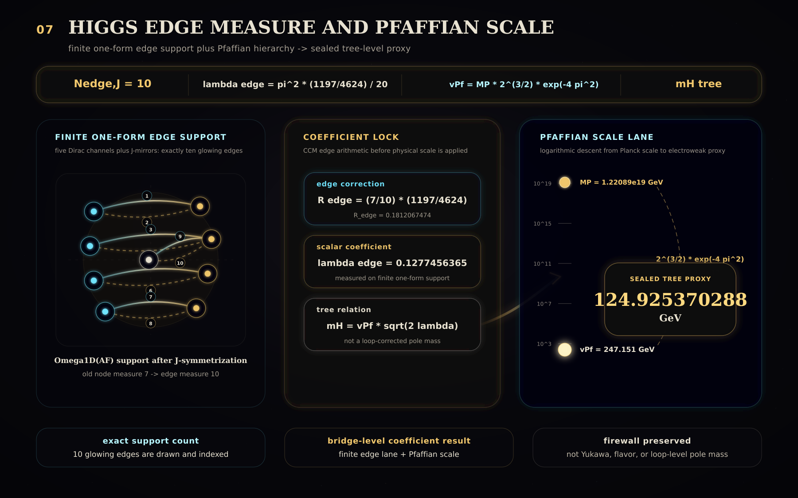

# ASHA Engine

**A theorem-gated finite Clifford–geometric research engine for reconstructing the Standard Model law-space, its almost-commutative spectral-action embedding, and the precise boundary between derived structure and environmental data.**

ASHA starts from $C\ell(1,7)$ as a finite measurement ladder and builds upward: Boolean–octonionic contact geometry, a finite Standard Model spectral triple, inner fluctuations, the $M\times F$ almost-commutative product geometry, and the Chamseddine–Connes–Marcolli spectral-action coefficient lane. The result is not a vague numerology project. It is a theorem-gated engine that separates **native derivations**, **bridge conventions**, **quarantined family axioms**, **environmental coordinates**, and **failed routes**. Its strongest mature result is a finite SM+gravity law-space architecture with a tree-level Higgs proxy emerging from **Higgs-as-one-form edge support** plus the Pfaffian scale lane:

$$
m_H^{\rm tree}\approx124.925370288\ {\rm GeV}.
$$

ASHA is ambitious, but disciplined: it derives the finite internal law-space and its spectral-action embedding, while explicitly preserving the flavor and cosmology firewalls where the current mathematics does not yet select the physical vacuum.

[](./docs/visuals/media/ASHAEssentialTower.mp4)
---

## Method: Theorem-Gated Physics

ASHA is intentionally built as a theorem-gated engine.

The finite core does **not** begin by fitting observed constants. It begins with exact algebraic structure, lets finite dynamics and variational tests act on that structure, then checks gauge/topological consistency, and only afterward allows bridge-layer physics such as RG flow, threshold matching, pole conversion, or cosmological interpretation.

The method is:

```text
exact algebra first
→ variational finite dynamics second
→ gauge, anomaly, and topology tests third
→ bridge-layer physics last
````

This matters because every numerical result in ASHA must answer a strict question:

```text
Was it derived natively?
Was it selected by a finite variational principle?
Was it only a bridge-layer consequence?
Was it inserted as a quarantined seal?
Or was the route rejected?
```

No observed physical constants are hard-coded into the finite core.
When empirical or environmental data is used, it is explicitly marked as a seal, boundary condition, comparison value, or bridge-layer input.

That discipline is part of the engine itself.

ASHA is therefore not only a collection of formulas; it is a claim-control system for theoretical physics.

---

## Quick Links

* **Quick Start:** [`quick-start`](./QUICK_START.md)
* **Paper:** [`paper`](./asha_paper.pdf)
* **Runtime Result:** [`result`](./runtime_result.md)
* **Detailed documentation:** [`docs/`](./docs)
* **Gate audits:** [`docs/gates/`](./docs/gates)
`

For a fast orientation, start with:

```bash
go test ./pkg/bridge/ashafinalarchitectureledger
go test ./pkg/bridge/innerfluctuationedgemeasure
go test ./pkg/bridge/publicationbundlepreflight
```

Avoid using `go test ./...` as the default workflow unless running a full intentional validation pass. Many packages are theorem/audit modules and are better validated by targeted gate groups.

---

## What ASHA Builds

ASHA is organized as a sequence of theorem-gated constructions. The historical path explored many branches, but the final architecture has a clean logical tower:

```text
Cℓ(1,7) measurement ladder
→ Boolean/G₂ contact vacuum K₇
→ off-diagonal Higgs seed
→ Fock matter carrier
→ electroweak charge skeleton
→ Morita finite spectral triple
→ inner fluctuations give SM gauge + Higgs fields
→ M × F almost-commutative product geometry
→ CCM spectral-action coefficient lane
→ Higgs as finite one-form on Dirac edges
→ Pfaffian scale lane
→ sealed Higgs tree proxy
→ flavor/cosmology firewalls
→ quarantined K/X/Y family axiom capacity
→ publication-ready theorem atlas
```

Compressed:

$$
C\ell(1,7)
\Rightarrow
K_7
\Rightarrow
A_F=\mathbb C\oplus\mathbb H\oplus M_3(\mathbb C)
\Rightarrow
D_A
\Rightarrow
M\times F
\Rightarrow
S_{\rm CCM}
\Rightarrow
{\rm SM+Gravity}.
$$

The final state is:

```text
Native law-space sealed.
Flavor and cosmology remain explicit frontiers.
```

---

## Core Result in One Picture

ASHA’s mature architecture is an almost-commutative spectral triple:

$$
M\times F,
$$

with total Dirac operator

$$
D_{\text{total}} = D_M \otimes 1_F + \gamma_5 \otimes D_F
$$

The finite internal algebra is the Standard Model algebra:

$$
A_F=\mathbb C\oplus\mathbb H\oplus M_3(\mathbb C).
$$

The finite spectral triple supplies the internal law-space. The continuum manifold (M) supplies spacetime. Together they enter the Chamseddine–Connes–Marcolli spectral action:

$$
S_{\rm CCM}=\mathrm{Tr}f(D/\Lambda).
$$

The mature product-action skeleton contains:

$$
\text{Einstein gravity}
+
\text{vacuum channel}
+
\text{gauge kinetic terms}
+
\text{Higgs kinetic term}
+
\text{Higgs potential}
+
\text{Yukawa sector}
+
\text{higher curvature terms}.
$$

---

## Main Derived Structures

### 1. Finite Measurement Ladder

ASHA begins from:

$$
C\ell(1,7),
\qquad
\Lambda^\bullet\mathbb R^8.
$$

This is the finite measurement arena. It is not used as metaphor; it is the algebraic carrier from which the engine measures incidence, spinor structure, Fock matter, contact geometry, and internal spectral data.

---

### 2. Boolean–Octonionic Contact Vacuum

The first native vacuum object arises from the intersection of Boolean incidence geometry and $G_2$-octonionic calibration:

$$
P_B:\mathrm{rank}=56,
\qquad
P_G:\mathrm{rank}=14,
$$

$$
K_7=\mathrm{Im}(P_B)\cap\mathrm{Im}(P_G),
\qquad
\dim K_7=7.
$$

This $K_7$ contact space is one of the foundational finite objects of the engine.

---

### 3. Fock Matter Carrier

Matter is built on the finite Fock carrier:

$$
\mathcal F=\Lambda^\ast(\mathbb C^4),
\qquad
\dim\mathcal F=16.
$$

The native $B-L$ ledger appears as:

$$
B-L=-N_0+\frac13(N_1+N_2+N_3).
$$

This supports the matter charge bookkeeping needed for the Standard Model charge skeleton.

---

### 4. Electroweak Charge Skeleton

The engine reconstructs the familiar electroweak charge logic:

$$
Y=T_R^3+\frac12(B-L),
$$

$$
Q=T_L^3+Y.
$$

The canonical hypercharge normalization appears as:

$$
k_Y=\frac53,
$$

and the finite boundary weak-angle relation is:

$$
\sin^2\theta_W=\frac38.
$$

This is a boundary-level spectral-action relation, not the low-energy measured value after RG flow.

---

### 5. Finite Spectral Triple Core

The correct category is not ordinary second-quantized Fock lifting. The mature construction uses a Morita/bimodule finite Hilbert architecture.

The finite algebra is:

$$
A_F=\mathbb C\oplus\mathbb H\oplus M_3(\mathbb C).
$$

The true left-right bimodule structure resolves the direct-sum representation paradox and supports the finite first-order condition.

The legal finite Dirac edge graph includes the Standard Model Yukawa channels:

$$
Q_L\leftrightarrow u_R,
\qquad
Q_L\leftrightarrow d_R,
\qquad
L_L\leftrightarrow e_R,
\qquad
L_L\leftrightarrow\nu_R.
$$

The structural first-order condition is verified on the completed finite spectral-triple skeleton.

---

### 6. Inner Fluctuations Give the Field Content

Finite inner fluctuations are generated by:

$$
A_F^{(1)}=\sum_i a_i[D_F,b_i].
$$

The fluctuated finite Dirac operator is:

$$
D_A=D_F+A+JAJ^{-1}.
$$

This recovers the Standard Model field-content skeleton:

$$
U(1)_Y\times SU(2)_L\times SU(3)_C,
$$

with:

$$
1+3+8=12
$$

gauge directions, and exactly one complex Higgs doublet from finite one-form edge content.

---

## Higgs Lane: The Mature Correction

A major correction in the project was recognizing that the Higgs is not node-supported.

The old contact-node intuition used:

$$
N_{\rm node}=7.
$$

The mature finite spectral-triple result is:

```text
The Higgs is a finite one-form.
Finite one-forms are supported on Dirac edges.
```

The $J$-doubled finite Dirac edge support has:

$$
N_{\rm edge,J}=10.
$$

The raw contact scalar ratio is:

$$
R_{\rm node}=\frac{1197}{4624}.
$$

The edge-measure correction gives:

$$
R_{\text{edge}} = \frac{7}{10}R_{\text{node}}
$$


The mature Higgs coefficient lane becomes:

$$
\lambda_{\text{edge}} = \frac{\pi^2(1197/4624)}{2\cdot10}
$$

Together with the Pfaffian scale lane,

$$
v_{\rm Pf}=M_P,2^{3/2}e^{-4\pi^2},
$$

the tree-level Higgs proxy is:

$$
m_H^{\text{tree}} = v_{\text{Pf}} \sqrt{ 2\cdot \frac{\pi^2(1197/4624)}{2\cdot10} }
$$


$$
m_H^{\rm tree}
\approx124.925370288\ {\rm GeV}.
$$

This is a **tree-level CCM+Pfaffian proxy**, not a full collider pole-mass calculation. RG flow, threshold matching, and pole conversion remain separate QFT tasks.

---

## What ASHA Claims

ASHA claims a finite, theorem-gated architecture for the Standard Model internal law-space and its almost-commutative spectral-action embedding.

| Claim                                                                             | Status                            |
| --------------------------------------------------------------------------------- | --------------------------------- |
| $C\ell(1,7)$ finite measurement ladder                                            | Native                            |
| Boolean/$G_2$ contact vacuum $K_7$                                                | Native                            |
| Standard Model finite algebra $A_F=\mathbb C\oplus\mathbb H\oplus M_3(\mathbb C)$ | Native structural result          |
| Hypercharge normalization $k_Y=5/3$                                               | Native boundary relation          |
| $\sin^2\theta_W=3/8$                                                              | Native boundary relation          |
| Inner fluctuations produce SM gauge + Higgs field content                         | Native structural result          |
| Almost-commutative $M\times F$ product geometry                                   | Mature architecture               |
| CCM spectral-action coefficient lane                                              | Bridge / coefficient framework    |
| Higgs one-form edge-measure correction                                            | Native support theorem            |
| $m_H^{\rm tree}\approx124.925$ GeV                                                | Tree-level proxy                  |
| $13$ charged flavor moduli remain                                                 | Firewall / native moduli census   |
| $K/X/Y$ family operators                                                          | Quarantined family axiom capacity |
| Dark matter abundance / cosmological constant / universe lifetime                 | Not derived                       |

---

## What ASHA Does Not Claim

ASHA does **not** claim:

* a full parameter-free numerical Theory of Everything,
* derived Yukawa masses,
* derived CKM or PMNS values,
* derived strong CP angle,
* derived dark matter relic abundance,
* derived observed cosmological constant,
* derived universe lifetime,
* a complete collider pole-mass computation for the Higgs,
* native promotion of the contact quartic $q_4$ into the Higgs scalar carrier,
* native promotion of the quarantined $K/X/Y$ family chain into a theorem.

These are explicit firewalls, not omissions hidden in the text.

---

## Flavor Frontier

The native finite-Dirac charged flavor moduli space has dimension:

$$
\dim\mathcal M_{\rm charged}=13.
$$

Decomposition:

$$
13=
6\ \text{quark masses}
+
4\ \text{CKM parameters}
+
3\ \text{charged-lepton masses}.
$$

The external minimal ledger is:

$$
15 = 13 + \theta_{\text{QCD}} + 1\ \text{absolute scale}
$$


The post-387 gates tested triality, contact rational singleton blocks, contact quartic blocks, edge graphs, scalar-bundle identities, and fermionic family-bundle extensions. None natively reduced the $13$ charged moduli.

A quarantined family-axiom chain exists:

$$
K_{\rm gen}=\mathrm{diag}(-1,0,1),
$$

$$
X_{\rm gen}=S+S^T,
$$

$$
Y_{\rm gen}=i(S-S^T).
$$

Sector-source texture:

$$
M_s=a_sK_{\rm gen}+b_sX_{\rm gen}+c_sY_{\rm gen},
\qquad
s\in\{u,d,e\}.
$$

This gives hierarchy, mixing, and CP capacity, but it is not a native ASHA theorem. It is explicitly quarantined as a possible family-sector extension.

---

## Contact Quartic Firewall

The contact quartic primary is exact and important:

$$
q_4(x)=3240x^4-7668x^3+6426x^2-2235x+271.
$$

It defines:

$$
C_{q_4}=\mathbb Q[x]/(q_4).
$$

But the later audits show:

```text
q₄ lives in the contact sector.
q₄ is not the Higgs scalar carrier.
q₄ is not a flavor matrix.
q₄ is not a Yukawa selector.
```

The mature Higgs result comes from the CCM edge-measure one-form lane, not from promoting $q_4$ into $H_\phi$.

---

## Cosmology and Dark Sector Firewall

ASHA does not yet derive hard cosmological observables.

Still open:

$$
\Omega_{\rm DM}h^2,
$$

$$
\rho_\Lambda,
$$

$$
\tau_{\rm universe},
$$

$$
f_4\Lambda^4+\text{vacuum subtraction rule}.
$$

The engine contains meaningful finite structures and sealed hierarchy lanes, but a cosmological history requires additional continuum dynamics, stability data, interaction rates, Boltzmann kernels, and vacuum subtraction rules.

---

## Repository Structure

A typical layout is:

```text
.
├── docs/
│   ├── gates/
│   ├── summaries/
│   ├── theorem-atlas/
│   └── paper/
├── pkg/
│   └── bridge/
│       ├── ashafinalarchitectureledger/
│       ├── innerfluctuationedgemeasure/
│       ├── publicationbundlepreflight/
│       └── ...
├── paper/
├── artifacts/
└── README.md
```

Important package families:

```text
pkg/bridge/*spectral*
pkg/bridge/*higgs*
pkg/bridge/*flavor*
pkg/bridge/*cosmology*
pkg/bridge/*publication*
```

---

## Reproducibility

Recommended targeted checks:

```bash
go test ./pkg/bridge/ashafinalarchitectureledger
go test ./pkg/bridge/innerfluctuationedgemeasure
go test ./pkg/bridge/publicationbundlepreflight
```

For publication-level checks:

```bash
go test ./pkg/bridge/publicationtheorematlas
go test ./pkg/bridge/manuscriptskeletonexport
go test ./pkg/bridge/executiveabstractclaimaudit
go test ./pkg/bridge/reviewerobjectionmatrix
go test ./pkg/bridge/artifactindexexport
go test ./pkg/bridge/publicationbundlepreflight
```

For Higgs-lane checks:

```bash
go test ./pkg/bridge/ccmpfaffianf0closure
go test ./pkg/bridge/finitetraceedgemultiplicity
go test ./pkg/bridge/rawfinitetracerecomputation
go test ./pkg/bridge/innerfluctuationedgemeasure
```

For flavor-firewall checks:

```bash
go test ./pkg/bridge/trialitymodulisieve
go test ./pkg/bridge/generationaddressfunctor
go test ./pkg/bridge/familyaxiomclosureledger
```

---

## Publication Status

The project has a publication-preflight layer:

* theorem atlas,
* manuscript skeleton,
* executive claim audit,
* reviewer objection matrix,
* artifact index,
* reproducibility checklist,
* final paper assembly preflight.

The final publication stance is:

```text
ASHA is a finite Standard Model + gravity law-space architecture
with explicit bridge lanes and firewalls.
```

Not:

```text
ASHA predicts every observed parameter from zero input.
```

---

## Final Essence

ASHA is a theorem-gated finite-geometry engine.

It derives:

```text
finite internal Standard Model law-space
+ almost-commutative product geometry
+ CCM spectral-action embedding
+ Higgs one-form edge-measure tree proxy.
```

It explicitly does not yet derive:

```text
flavor coefficients
+ CKM/PMNS values
+ dark matter abundance
+ cosmological constant
+ full pole-mass precision.
```

That distinction is the point.

ASHA’s promise is not that everything is forced too early.
Its promise is that every claim is placed in the correct layer:

```text
native theorem
bridge convention
quarantined axiom
environmental coordinate
failed route.
```

That is the engine.