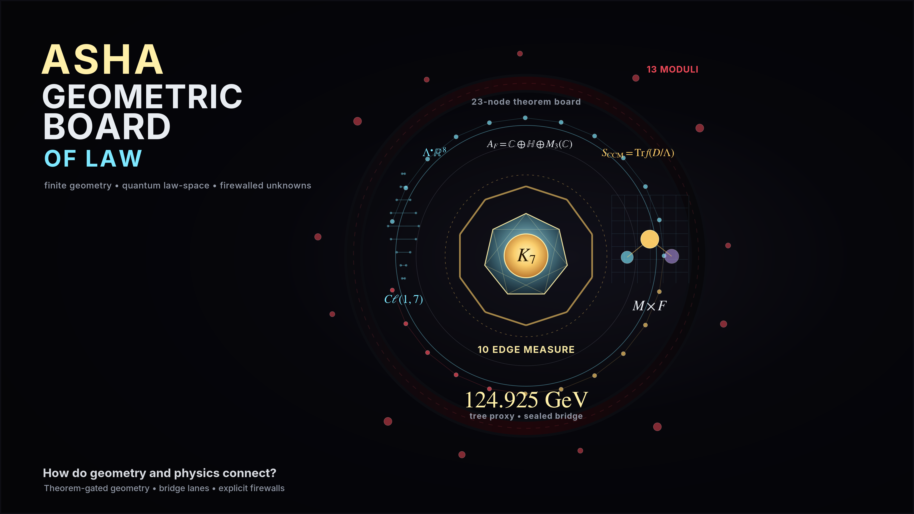

# ASHA Engine

**A theorem-gated finite Clifford–geometric research engine for reconstructing the Standard Model law-space, its almost-commutative spectral-action embedding, and the precise boundary between derived structure and environmental data.**

ASHA starts from $C\ell(1,7)$ as a finite measurement ladder and builds upward: Boolean–octonionic contact geometry, a finite Standard Model spectral triple, inner fluctuations, the $M\times F$ almost-commutative product geometry, heat-kernel/spectral-action coefficient lanes, anomaly ledgers, electroweak bridge airlocks, and scale-free gravitational topology sockets.

The result is not a vague numerology project. It is a theorem-gated engine that separates **native derivations**, **bridge conventions**, **quarantined family axioms**, **environmental coordinates**, and **failed routes**.

-[](./docs/visuals/media/ASHAEssentialTower.mp4)


Current runtime state:

```text
Latest gate: 529
Runtime: gate529-3plus1-projection-bridge-airlock-preflight-20260515
```

The most important current correction is this:

```text
ASHA derives law-space, sockets, consistency ledgers, and scale-free topology.
ASHA does not claim that all observed constants are forced by finite algebra.
```

That distinction is the engine.

---

## Method: Theorem-Gated Physics

ASHA is intentionally built as a theorem-gated engine.

The finite core does **not** begin by fitting observed constants. It begins with exact algebraic structure, lets finite dynamics and variational tests act on that structure, checks gauge/topological consistency, and only afterward allows bridge-layer physics such as RG flow, threshold matching, pole conversion, continuum matching, or cosmological interpretation.

The method is:

```text
exact algebra first
→ variational finite dynamics second
→ gauge, anomaly, and topology tests third
→ bridge-layer physics last
```

Every numerical or structural result must answer a strict question:

```text
Was it derived natively?
Was it selected by a finite variational principle?
Was it only a bridge-layer consequence?
Was it inserted as a quarantined seal?
Or was the route rejected?
```

No observed physical constants are hard-coded into the finite core. When empirical or environmental data is used, it is explicitly marked as a seal, boundary condition, comparison value, or bridge-layer input.

ASHA is therefore not only a collection of formulas; it is a **claim-control system for theoretical physics**.

---

## Quick Links

- **Quick Start:** [`QUICK_START.md`](./QUICK_START.md)
- **Runtime Result:** [`runtime_result.md`](./runtime_result.md)
- **Paper artifact:** [`asha_paper.pdf`](./asha_paper.pdf)
- **Documentation:** [`docs/`](./docs)
- **Gate audits:** [`docs/audits/gates/`](./docs/audits/gates)
- **Gate index:** [`docs/audits/gates/INDEX.md`](./docs/audits/gates/INDEX.md)
- **Formula ledger:** [`docs/summaries/formula_ledger.md`](./docs/summaries/formula_ledger.md)
- **Ontological tower:** [`docs/summaries/essential_ontological_tower_map.md`](./docs/summaries/essential_ontological_tower_map.md)

For a fast orientation, start with targeted checks rather than a full repository sweep:

```bash
go test ./pkg/asha ./cmd/asha
```

Avoid using `go test ./...` as the default workflow unless running a full intentional validation pass. Many packages are theorem/audit modules and are better validated by targeted gate groups.

---

## One-Line Board Closure

ASHA currently closes as a theorem-gated finite-geometric **law-space**:

$$
C\ell(1,7)
\Rightarrow K_7
\Rightarrow A_F=\mathbb C\oplus\mathbb H\oplus M_3(\mathbb C)
\Rightarrow D_{M\times F}
\Rightarrow S_{\rm CCM}
\Rightarrow {\rm SM+gravity\ law\ space}.
$$

The current board is not:

```text
a parameter-free numerical theory of every observed constant.
```

It is:

```text
a finite native law-space plus explicit bridge and environmental airlocks.
```

---

## Current Ontological Ladder

The historical gate path explored many branches. The current architecture has a cleaner logical ladder:

```text
0. Cℓ(1,7) finite measurement ladder
1. Boolean/G₂ contact vacuum K₇
2. off-diagonal finite scalar seed
3. Fock matter carrier and B-L ledger
4. electroweak charge skeleton
5. Morita/bimodule finite spectral triple
6. inner fluctuations: SM gauge + Higgs field-content socket
7. M × F almost-commutative product geometry
8. heat-kernel / CCM spectral-action coefficient lanes
9. null-C3 family baseline and flavor firewall
10. topological anomaly cancellation ledger
11. scalar/electroweak quotient and continuum matching airlocks
12. gravitational spectral sockets: a0, a2, a4
13. scale-free characteristic classes and APS/boundary topology airlocks
```

Compressed:

$$
S_{\text{ASHA}} = S_{\text{native}}(C\ell(1,7),K_7,A_F,D_{M\times F}) + S_{\text{bridge}}(f_0,f_2,f_4,\Lambda,\text{matching data}) + S_{\text{sealed}}(Y,\text{CKM},\text{PMNS},v,G,\rho_\Lambda,\chi,\eta,\ldots)
$$


---

## Core Product Geometry

ASHA’s mature architecture is an almost-commutative spectral triple:

$$
M\times F.
$$

The total Dirac operator is:

$$
D_{\rm total}=D_M\otimes 1_F+\gamma_5\otimes D_F.
$$

The finite internal algebra is the Standard Model algebra:

$$
A_F=\mathbb C\oplus\mathbb H\oplus M_3(\mathbb C).
$$

The finite spectral triple supplies the internal law-space. The continuum manifold $M$ supplies spacetime. Together they enter the spectral action:

$$
S_{\rm CCM}=\mathrm{Tr}\, f(D/\Lambda).
$$

The mature product-action skeleton contains sockets for:

```text
Einstein-Hilbert gravity
+ cosmological volume channel
+ gauge kinetic terms
+ Higgs kinetic term
+ Higgs potential channel
+ Yukawa sector sockets
+ higher-curvature/topological terms.
```

A socket is not automatically a prediction. The engine only promotes a socket when the required theorem closes.

---

## Native Finite Structures

### 1. Finite measurement ladder

ASHA begins from:

$$
C\ell(1,7),
\qquad
\Lambda^\bullet \mathbb R^8.
$$

This is the finite measurement arena. It is not a metaphor; it is the algebraic carrier from which the engine measures incidence, spinor structure, Fock matter, contact geometry, and internal spectral data.

Grade dimensions:

$$
[1,8,28,56,70,56,28,8,1],
\qquad
\dim C\ell(1,7)=256.
$$

---

### 2. Boolean–octonionic contact vacuum

The first native vacuum object arises from Boolean incidence geometry and $G_2$-octonionic calibration:

$$
P_B:\mathrm{rank}=56,
\qquad
P_G:\mathrm{rank}=14.
$$

The contact vacuum is:

$$
K_7=\mathrm{Im}(P_B)\cap\mathrm{Im}(P_G),
\qquad
\dim K_7=7.
$$

The $K_7$ contact space is one of the foundational finite objects of the engine.

---

### 3. Fock matter carrier

Matter is built on the finite Fock carrier:

$$
\mathcal F=\Lambda^\ast(\mathbb C^4),
\qquad
\dim\mathcal F=16.
$$

The native $B-L$ ledger appears as:

$$
B-L=-N_0+\frac13(N_1+N_2+N_3).
$$

This supports the matter charge bookkeeping needed for the Standard Model charge skeleton.

---

### 4. Electroweak charge skeleton

The engine reconstructs the familiar electroweak charge logic:

$$
Y=T_R^3+\frac12(B-L),
\qquad
Q=T_L^3+Y.
$$

The canonical hypercharge normalization appears as:

$$
k_Y=\frac53.
$$

The finite boundary weak-angle relation appears as:

$$
\sin^2\theta_W=\frac38.
$$

This is a high-scale/boundary normalization relation. It is **not** the low-energy observed weak mixing angle after RG flow and continuum matching.

---

### 5. Finite spectral triple core

The correct category is not ordinary second-quantized Fock lifting. The mature construction uses a Morita/bimodule finite Hilbert architecture.

The finite algebra is:

$$
A_F=\mathbb C\oplus\mathbb H\oplus M_3(\mathbb C).
$$

The legal finite Dirac edge graph includes the Standard Model Yukawa channels:

$$
Q_L\leftrightarrow u_R,
\qquad
Q_L\leftrightarrow d_R,
\qquad
L_L\leftrightarrow e_R,
\qquad
L_L\leftrightarrow \nu_R.
$$

The structural first-order condition is verified on the completed finite spectral-triple skeleton.

---

### 6. Inner fluctuations and field content

Finite inner fluctuations are generated by:

$$
A=\sum_i a_i[D_F,b_i].
$$

The fluctuated finite Dirac operator is:

$$
D_A=D_F+A+JAJ^{-1}.
$$

This recovers the Standard Model field-content skeleton:

$$
U(1)_Y\times SU(2)_L\times SU(3)_C,
$$

with:

$$
1+3+8=12
$$

gauge directions, and exactly one complex Higgs doublet from finite one-form edge content.

---

## Higgs and Scalar Lane: Mature Correction

A major correction in the project was recognizing that the Higgs is not node-supported.

The old contact-node intuition used:

$$
N_{\rm node}=7.
$$

The mature finite spectral-triple result is:

```text
The Higgs is a finite one-form.
Finite one-forms are supported on Dirac edges.
```

The $J$-doubled finite Dirac edge support has:

$$
N_{{\rm edge},J}=10.
$$

The historical edge-measure/Pfaffian lane produced a sealed tree-level Higgs proxy:

$$
m_H^{\rm tree}\approx124.925370288\ {\rm GeV}.
$$

Current status after Gates 491–508:

```text
Higgs one-form edge support: structurally supported.
Ghost-free scalar kinetic trace class: supported.
Goldstone 4 = 1 + 3 quotient: conditionally supported.
Photon zero mode: structurally protected in the bridge quotient.
Physical W/Z masses: not derived.
Physical weak angle: not derived.
Higgs VEV: not derived.
Canonical scalar kinetic normalization: not natively closed.
```

The proxy remains useful as a historical sealed bridge lane, not as a native pole-mass or collider-scale theorem.

---

## Null-C3 Family Baseline and Koide Result

Gates 484–485 clarified the C3 mass-shadow geometry.

For a normalized C3 square-root shadow:

$$
x_i=\sqrt{m_i}=S+R\cos(\theta_i-\psi),
\qquad
\theta_i\in\{0,2\pi/3,4\pi/3\},
$$

the democratic component has norm:

$$
\|x_{\rm dem}\|^2=3S^2,
$$

and the phase-plane component has norm:

$$
\|x_{\rm phase}\|^2=\frac32R^2.
$$

The native null boundary condition is:

$$
3S^2-\frac32R^2=0.
$$

Therefore:

$$
\frac RS=\sqrt2.
$$

This is equivalent to the Koide ratio:

$$
Q=\frac23.
$$

Current status:

```text
Native result: the null-C3 baseline fixes the shape ratio R/S = sqrt(2).
Not derived: absolute charged-lepton masses.
Not derived: C3 phase ψ.
Not derived: quark masses.
Not derived: CKM or PMNS.
Not derived: collapse of the full 13 flavor moduli.
```

The Koide result is a genuine shape theorem, not a hidden mass fit.

---

## Flavor and Yukawa Firewall

The native finite-Dirac charged flavor moduli space remains:

$$
\dim\mathcal M_{\rm charged}=13.
$$

Decomposition:

$$
13=
6\ \text{quark masses}
+4\ \text{CKM parameters}
+3\ \text{charged-lepton masses}.
$$

Gates 444–489 aggressively tested structural-zero branches, coefficient-ray observability, empirical comparator interfaces, CKM sockets, null-C3 compression, commutator polynomial constraints, up/down operator provenance, and Yukawa selector candidates.

The conclusion is now sharper than before:

```text
ASHA has native Yukawa sockets.
ASHA does not have a native Yukawa selector.
Yukawa amplitudes, CKM orientation, PMNS orientation, and Jarlskog data remain environmental/bridge data.
```

The formal closure point is:

```text
FIREWALL_CLOSED_NATIVE_YUKAWA_SELECTOR_BRANCH
```

A quarantined family-axiom capacity remains available for exploration:

$$
K_{\rm gen}=\mathrm{diag}(-1,0,1),
$$

$$
X_{\rm gen}=S+S^T,
\qquad
Y_{\rm gen}=i(S-S^T),
$$

with sector-source texture:

$$
M_s=a_sK_{\rm gen}+b_sX_{\rm gen}+c_sY_{\rm gen},
\qquad
s\in\{u,d,e\}.
$$

This gives hierarchy, mixing, and CP capacity, but it is **not** a native ASHA theorem. It is explicitly quarantined as a possible family-sector extension or comparator model.

---

## Topological Charge and Anomaly Ledger

Gate 490 redirected from mass to topology.

The one-generation left-handed Weyl ledger contains 16 discrete states and four weak doublets. The anomaly traces cancel exactly as rational representation traces:

```text
Tr(Y)        = 0
Tr(Y^3)      = 0
SU(2)_L^2·Y  = 0
SU(3)_c^2·Y  = 0
SU(3)_c^3    = 0
SU(2)_L^3    = 0
Witten SU(2) = cleared by 4 weak doublets
Tr(B-L)      = 0
Tr((B-L)^3)  = 0
```

This is a native, mass-independent topological stability theorem.

It does not select Yukawa textures, CKM, PMNS, Jarlskog, or particle masses.

---

## Electroweak Quotient and Matching Airlocks

Gates 491–508 audited the scalar/electroweak branch after the flavor closure.

Accepted structural content:

```text
Higgs one-form edge support inherited.
Scalar kinetic Hilbert-Schmidt class is positive semidefinite.
Negative ghost kinetic route is blocked.
The scalar socket has a 4 = 1 + 3 Goldstone quotient diagnostic.
The photon direction is the stabilizer of a nonzero Higgs ray.
The broken electroweak orbit has rank 3.
```

The bridge quotient preserves:

```text
photon kernel dimension = 1
broken orbit rank       = 3
radial scalar quotient  = 1
normalized broken Hessian shape = diag(1,1,4)
```

But the same gates block native promotion of physical electroweak quantities:

```text
native Higgs VEV: false
native gauge couplings: false
native weak mixing angle: false
native W/Z masses: false
native kappa_U1 = 6: false
observed W/Z mass ratio from quotient: false
```

The tree-level bridge formulas are allowed only inside an explicit continuum adapter:

$$
m_W=\frac{g_2v}{2},
\qquad
m_Z=\frac{\sqrt{g_2^2+g_Y^2}\,v}{2},
$$

$$
\sin^2\theta_W=\frac{g_Y^2}{g_2^2+g_Y^2},
\qquad
m_\gamma=0.
$$

These are bridge formulas, not native predictions.

---

## Gravity and Spectral-Action Sockets

Gates 509–515 redirected to gravity and spectral coefficients.

The Dirac-square/Lichnerowicz channel gives the scalar-curvature socket:

$$
D^2\ \leadsto\ E_R=-\frac R4,
$$

and the heat-kernel $a_2$ channel contains:

$$
E+\frac R6=-\frac R{12}.
$$

With finite trace:

$$
\mathrm{Tr}_F(1)=96,
$$

the native dimensionless curvature weight is:

$$
\frac{\mathrm{Tr}_F(1)}{12}=8.
$$

The raw Einstein-Hilbert socket coefficient has the form:

$$
|C_R|=f_2\Lambda^2\,\frac{\mathrm{Tr}_F(1)}{192\pi^2}
=f_2\Lambda^2\,\frac{1}{2\pi^2}.
$$

Current status:

```text
Einstein-Hilbert scalar-curvature socket: present.
Dimensionless a2 trace weight: native.
Newton constant: not derived.
Planck scale: not derived.
Cutoff Λ: not selected.
f2 moment: not separated from Λ.
Einstein-Hilbert physical normalization: open.
```

---

## Spectral Moment Hierarchy

Gates 510–513 isolated the stripped heat-kernel hierarchy.

The three main channels are:

```text
a0: volume / cosmological channel     scales as f4 Λ^4
a2: Einstein-Hilbert curvature socket scales as f2 Λ^2
a4: curvature²/topological socket     scales as f0
```

With $\mathrm{Tr}_F(1)=96$:

$$
\frac{C_0}{f_4\Lambda^4}=\frac{6}{\pi^2},
$$

$$
\frac{C_2}{f_2\Lambda^2}=\frac{1}{2\pi^2},
$$

$$
\frac{C_4}{f_0}=\frac{1}{60\pi^2}.
$$

The stripped ratios are:

$$
\frac{a_2}{a_0}=\frac1{12},
\qquad
\frac{a_4}{a_0}=\frac1{360},
\qquad
\frac{a_4}{a_2}=\frac1{30}.
$$

These are native combinatorial/spectral prefactors.

They do **not** select:

```text
Λ
f2
f4
f2Λ²
f4Λ⁴
Newton constant
cosmological constant
vacuum subtraction rule
```

---

## Cosmological Constant Airlock

The $a_0$ cosmological volume channel is present:

$$
\frac{C_\Lambda}{f_4\Lambda^4}
=\frac{\mathrm{Tr}_F(1)}{16\pi^2}
=\frac6{\pi^2}.
$$

The finite trace is positive:

$$
\mathrm{Tr}_F(1)=96>0.
$$

Therefore there is no native self-cancellation of the volume term in the current finite ledger.

Blocked:

```text
observed dark energy
cosmological constant
f4 selection
cutoff Λ selection
vacuum subtraction
renormalization scheme
manifold volume / boundary data
```

---

## Scale-Free Gravity Topology

Gate 516 confirmed the scale-free characteristic-class ledger.

The $a_4$ topology sockets include:

```text
Euler / Gauss-Bonnet
Pontryagin / signature
chiral index socket
mixed gravitational-U(1) trace cancellation
```

The four-dimensional curvature basis includes:

$$
E_4=R_{\rm Riem}^2-4R_{\rm Ric}^2+R^2,
$$

$$
C^2=R_{\rm Riem}^2-2R_{\rm Ric}^2+\frac13R^2.
$$

These sockets are independent of:

```text
Λ
f2
f4
G
cosmological constant
Higgs/EW scale
flavor/Yukawa data
observed topology
```

But the finite algebra does not select the global topology of the continuum manifold.

Blocked:

```text
χ(M)
τ(M)
Pontryagin numbers
boundary η-invariant
gravitational theta angle
closedness / boundary condition
```

---

## Index, APS Boundary, and Topology Airlocks

Gate 517 accepted the local chiral index socket:

$$
[\widehat A(R)\,\mathrm{ch}(E)]_4.
$$

The APS boundary formula is:

$$
\text{ind}_{\text{APS}}(D_E) = \int_M [\widehat A(R)\,\text{ch}(E)]_4 -\frac{\eta(D_{\partial})+h}{2}
$$

Gate 518 tested synthetic APS plumbing only. Gate 519 then defined the observed topology and boundary comparator preflight. Gate 520 exercised that airlock with an explicit synthetic file-backed ledger, computing only bridge residuals while blocking native global-topology writes. Gate 521 added the bordism/cobordism classifier airlock: ASHA can state oriented, spin, spin-c, characteristic-number, and boundary-bordism admissibility constraints, but it still cannot select the universe’s manifold class or boundary spectrum natively. Gate 522 made that classifier file-backed: a synthetic Stiefel-Whitney/spin/spin-c ledger can be loaded and checked bridge-only. Gate 523 then aggregates the Gate 520 APS/signature residuals and Gate 522 bordism residuals into a bridge-only topology residual report, while explicitly blocking any claim that zero residuals select a native manifold. Gate 524 closes the anomaly-inflow compatibility check: the local index-density, Chern-Simons/transgression, APS pairing, and exact anomaly-zero ledgers confirm native inflow capacity for admissible bridge topology classes, while still refusing to select a boundary, eta spectrum, bordism representative, or cross-fixture universe identity. Gate 525 then closes the topology sector as a law/history ledger: native local topology and inflow capacity are frozen as ASHA law-space, while the actual manifold, boundary, eta spectrum, characteristic numbers, flavor texture, electroweak scale, and gravity/cosmology normalization remain bridge/environmental history. The next selected native frontier is Lorentzian/causal signature provenance. Gate 526 opens that frontier: the native C\ell(1,7) seed provides a 1+7 quadratic signature socket and scale-free null cone, but the Euclidean heat-kernel/spectral-action ledger remains elliptic. Wick rotation, time orientation, positive energy, reflection positivity, real-time unitarity, global hyperbolicity, and physical 3+1 spacetime projection are now explicitly bridge obligations rather than native registry writes. Gate 527 then audits the Lorentzian spinor-adjoint layer: the C\ell(1,7) signature gives an indefinite/Krein adjoint socket compatible with charge conjugation and grading, but it still does not select a positive Hilbert product, a fundamental symmetry, reflection positivity/OS reconstruction, Wick continuation, positive energy, unitary real-time dynamics, or a physical 3+1 spacetime projector. The admissible 1+7 -> (1+3)+4 split is now recorded as a bridge projection socket, not a native spacetime selection. Gate 528 then audits the Clifford projector question directly: C\ell(1,7) has volume/chirality idempotent sockets and a rank-four projector can be written after choosing a four-plane, but chirality does not project the base vector space into a canonical 4+4 split, no Spin(1,7)-invariant rank-four vector projector is selected, and physical 3+1 spacetime plus an internal four-dimensional complement remain bridge data. Gate 529 turns that obstruction into a fail-closed dimensional-projection airlock: explicit `chosen_projector_matrix`, `external_signature_assignment=1+3`, and `internal_complement_assignment` rows may be accepted only as sourced, conventional, bridge-only data with native promotion rejected. The airlock also blocks the dependent assumptions: a 3+1 projector does not grant Wick rotation, positive Hilbert space, reflection positivity, positive energy, unitary real-time dynamics, global hyperbolicity, or native internal-gauge identification.

The topology airlock now requires bridge-only metadata for:

```text
Euler characteristic χ(M)
Pontryagin classes p_i(M)
signature τ(M)
global APS index
manifold dimension
orientation / closedness
model ID
```

The boundary airlock requires bridge-only metadata for:

```text
boundary condition type
eta invariant η(D_∂)
kernel dimension h
boundary spectrum metadata
boundary orientation
component count
boundary model ID
```

Every row must carry:

```text
source/version
uncertainty
scheme/context
bridge_only = true
native_promotion = false
comparator-only purpose
no-theorem-input flag
```

No observed topology or boundary number is imported by default.

---

## Contact Quartic Firewall

The contact quartic primary is exact and important:

$$
q_4(x)=3240x^4-7668x^3+6426x^2-2235x+271.
$$

It defines:

$$
C_{q_4}=\mathbb Q[x]/(q_4).
$$

But later audits show:

```text
q4 lives in the contact sector.
q4 is not the Higgs scalar carrier.
q4 is not a flavor matrix.
q4 is not a Yukawa selector.
```

The mature Higgs result comes from the inner-fluctuation finite one-form lane, not from promoting $q_4$ into $H_\phi$.

---

## Gate 444 → 519 Progress Map

The post-444 sequence changed the public status of ASHA significantly.

| Gate range | What was tested | Current outcome |
|---:|---|---|
| 444–452 | Generation-2 structural zero, mass-lift, phase, basis-invariance | texture branches audited; no native flavor prediction |
| 453–471 | empirical texture/CKM comparator airlocks and rank-complete ledgers | bridge comparator path exists; observed values never native |
| 473–484 | null-cone, sector deformation, vacuum tilt, Koide shadow discovery | C3 null baseline prepared; flavor compression tested |
| 485 | Koide provenance | $R/S=\sqrt2$ and $Q=2/3$ derived as null-C3 shape theorem |
| 486–488 | CKM null mirror, commutator constraints, native up/down source | CKM 4→2 native theorem blocked; eigenbasis not determined by null spectrum |
| 489 | Yukawa selector closure | native Yukawa selector branch formally closed |
| 490 | anomaly ledger | gauge and mixed anomalies cancel exactly from discrete charge ledger |
| 491–503 | scalar edge, Goldstone quotient, electroweak Hessian/index | ghost-free scalar class and photon/rank-three quotient supported; physical W/Z data blocked |
| 504–508 | electroweak bridge permission, synthetic/observed adapters | safe comparator plumbing; no weak-angle or mass prediction |
| 509–513 | gravity socket, a2/a4/a0 coefficients, spectral hierarchy | curvature sockets and dimensionless prefactors accepted; $G$, $\Lambda$, $\rho_\Lambda$ blocked |
| 514–515 | cutoff/renormalization airlock and synthetic gravity adapter | bridge plumbing validated; no gravity/cosmology native normalization |
| 516–525 | characteristic classes, APS index, topology/boundary/bordism airlocks, anomaly inflow, topology closure | scale-free topology sockets and anomaly-inflow capacity accepted; file-backed comparator plumbing and bordism classifiers validated; global manifold/boundary data quarantined; topology sector closed as law/history ledger |
| 526–529 | Lorentzian causal signature, Krein adjoint, 3+1 projector audit, dimensional projection airlock | native 1+7 causal/null-cone socket confirmed; physical Hilbert space, Wick rotation, time arrow, unitary dynamics, and 3+1 projector remain bridge/environmental obligations |

---

## What ASHA Currently Claims

| Claim | Current status |
|---|---|
| $C\ell(1,7)$ finite measurement ladder | Native |
| Boolean/$G_2$ contact vacuum $K_7$ | Native |
| Standard Model finite algebra $A_F=\mathbb C\oplus\mathbb H\oplus M_3(\mathbb C)$ | Native structural result |
| Hypercharge normalization $k_Y=5/3$ | Native boundary relation |
| $\sin^2\theta_W=3/8$ | Boundary normalization, not low-energy measured value |
| Inner fluctuations produce SM gauge + Higgs field-content socket | Native structural result |
| Higgs as finite one-form edge support | Native support theorem |
| $m_H^{\rm tree}\approx124.925$ GeV | Sealed historical tree-level bridge proxy, not pole-mass theorem |
| Null-C3 Koide shape $R/S=\sqrt2$, $Q=2/3$ | Native shape theorem for bare colorless baseline |
| Full charged flavor moduli collapse | Not derived |
| Native Yukawa selector | Failed / closed firewall |
| Anomaly cancellation | Native topological charge theorem |
| Ghost-free scalar kinetic class | Supported as positive trace class |
| Electroweak photon kernel and rank-three broken orbit | Conditional representation/bridge quotient result |
| Physical W/Z masses and weak angle | Not derived |
| Einstein-Hilbert curvature socket | Present |
| Newton constant / Planck scale | Not derived |
| Cosmological constant | Not derived |
| $a_0/a_2/a_4$ stripped spectral hierarchy | Native dimensionless prefactors |
| Euler/Pontryagin/signature sockets | Scale-free topology sockets |
| Actual global topology $\chi(M),\tau(M),p_i(M)$ | Environmental/global data |
| Boundary $\eta$ invariant and APS index integer | Airlocked bridge/global data |
| Anomaly inflow capacity for admissible bridge topology classes | Native structural socket / bridge compatibility classifier |
| Lorentzian $C\ell(1,7)$ causal signature and null cone | Native 1+7 quadratic socket |
| Wick rotation / reflection positivity / time arrow | Not derived; Lorentzian bridge obligation |
| Positive Hilbert product / real-time unitarity | Not derived; Krein-to-Hilbert bridge obligation |
| Physical 3+1 spacetime projector | Not derived; explicit bridge airlock defined |
| Internal 4D complement as gauge space | Bridge convention only, not native selection |

---

## What ASHA Does Not Claim

ASHA does **not** claim:

- a full parameter-free numerical Theory of Everything,
- derived Yukawa masses,
- derived CKM or PMNS values,
- derived Jarlskog invariant,
- derived strong CP angle,
- derived Higgs VEV,
- derived physical weak mixing angle,
- derived W/Z masses,
- derived Newton constant,
- derived Planck scale,
- derived cutoff scale $\Lambda$,
- derived observed cosmological constant,
- derived dark matter relic abundance,
- derived universe lifetime,
- derived global topology of spacetime,
- derived APS boundary $\eta$ invariant,
- derived Wick rotation, OS reflection positivity, or the arrow of time,
- derived positive Hilbert product or real-time unitary dynamics,
- derived physical 3+1 spacetime projector from $C\ell(1,7)$,
- native identification of the 4D internal complement with gauge space,
- complete collider pole-mass computation for the Higgs,
- native promotion of the contact quartic $q_4$ into the Higgs scalar carrier,
- native promotion of the quarantined $K/X/Y$ family chain into a theorem.

These are explicit firewalls, not omissions hidden in the text.

---

## Repository Structure

A typical layout is:

```text
.
├── cmd/
│   └── asha/
├── data/
│   ├── electroweak_observed_bridge_ledger.json
│   ├── pdg_observed_ledger.json
│   └── pdg_rank_complete_ledger.json
├── docs/
│   ├── audits/gates/
│   ├── paper/
│   ├── runtime/
│   └── summaries/
├── internal/
│   └── app/
├── pkg/
│   ├── asha/
│   └── bridge/
└── README.md
```

Important package families:

```text
pkg/bridge/*generation2*
pkg/bridge/*spectral*
pkg/bridge/*higgs*
pkg/bridge/*scalar*
pkg/bridge/*electroweak*
pkg/bridge/*anomaly*
pkg/bridge/*gravity*
pkg/bridge/*topology*
pkg/bridge/*publication*
```

---

## Reproducibility

Use targeted tests. The latest runtime/package sanity checks are:

```bash
go test ./pkg/asha ./cmd/asha
```

Recent lane checks:

```bash
# Flavor/Yukawa closure
go test ./pkg/bridge/generation2yukawaselectorairlock \
        ./pkg/bridge/generation2koideprovenance \
        ./pkg/bridge/generation2ckmcommutatorpolynomial

# Lorentzian/causal signature and projection-airlock frontier
go test ./pkg/bridge/generation2projectionbridgeairlockpreflight \
        ./pkg/bridge/generation2physicalprojectionselector \
        ./pkg/bridge/generation2lorentzianspinoradjointairlock \
        ./pkg/bridge/generation2lorentziancausalsignature

# Topological anomaly ledger
go test ./pkg/bridge/generation2topologicalanomalyledger

# Electroweak quotient/airlock lane
go test ./pkg/bridge/generation2ewnquotient \
        ./pkg/bridge/generation2ewkernelindexclosure \
        ./pkg/bridge/generation2ewresidualgeometryairlock

# Gravity/spectral coefficient lane
go test ./pkg/bridge/generation2curvaturecoefficientprovenance \
        ./pkg/bridge/generation2spectralmomenthierarchyairlock \
        ./pkg/bridge/generation2cosmologicalf4vacuumairlock

# Topological gravity / APS / boundary / bordism / inflow airlocks
go test ./pkg/bridge/generation2anomalyinflowcompatibilityclassifier \
        ./pkg/bridge/generation2topologyresidualclassifierreport \
        ./pkg/bridge/generation2bordismcomparatorfileadapter \
        ./pkg/bridge/generation2observedtopologyboundaryfileadapter \
        ./pkg/bridge/generation2gravitationalindexetaairlock
```

Publication and legacy checks remain useful:

```bash
go test ./pkg/bridge/publicationtheorematlas
go test ./pkg/bridge/manuscriptskeletonexport
go test ./pkg/bridge/executiveabstractclaimaudit
go test ./pkg/bridge/reviewerobjectionmatrix
go test ./pkg/bridge/artifactindexexport
go test ./pkg/bridge/publicationbundlepreflight
```

---

## Reading Order

For the current state, read in this order:

```text
1. README.md
2. docs/audits/gates/gate485_registry_audit.md
3. docs/audits/gates/gate489_registry_audit.md
4. docs/audits/gates/gate490_registry_audit.md
5. docs/audits/gates/gate502_registry_audit.md
6. docs/audits/gates/gate508_registry_audit.md
7. docs/audits/gates/gate510_registry_audit.md
8. docs/audits/gates/gate513_registry_audit.md
9. docs/audits/gates/gate516_registry_audit.md
10. docs/audits/gates/gate519_registry_audit.md
11. docs/audits/gates/gate520_registry_audit.md
12. docs/audits/gates/gate521_registry_audit.md
13. docs/audits/gates/gate522_registry_audit.md
14. docs/audits/gates/gate523_registry_audit.md
15. docs/audits/gates/gate524_registry_audit.md
16. docs/audits/gates/gate525_registry_audit.md
17. docs/audits/gates/gate526_registry_audit.md
18. docs/audits/gates/gate527_registry_audit.md
19. docs/audits/gates/gate528_registry_audit.md
20. docs/audits/gates/gate529_registry_audit.md
```

Then use [`docs/audits/gates/INDEX.md`](./docs/audits/gates/INDEX.md) for the full gate trail.

---

## Publication Status

The project has a publication-preflight layer:

- theorem atlas,
- manuscript skeleton,
- executive claim audit,
- reviewer objection matrix,
- artifact index,
- reproducibility checklist,
- final paper assembly preflight.

The current publication stance is:

```text
ASHA is a finite Standard Model + gravity law-space architecture
with explicit bridge lanes, environmental airlocks, and firewalls.
```

Not:

```text
ASHA predicts every observed parameter from zero input.
```

---

## Final Essence

ASHA is a theorem-gated finite-geometry engine.

It derives or structurally supports:

```text
finite internal Standard Model law-space
+ almost-commutative product geometry
+ inner-fluctuation SM gauge/Higgs field-content socket
+ null-C3 Koide baseline shape
+ anomaly cancellation ledger
+ ghost-free scalar/electroweak quotient diagnostics
+ heat-kernel gravity sockets
+ scale-free gravitational characteristic-class/index sockets.
```

It explicitly does not yet derive:

```text
flavor coefficients
+ CKM/PMNS values
+ Yukawa amplitudes
+ Higgs VEV
+ physical W/Z masses
+ low-energy weak angle
+ Newton constant
+ cutoff scale
+ cosmological constant
+ dark matter abundance
+ global spacetime topology
+ boundary eta invariant
+ full pole-mass precision.
```

That distinction is the point.

ASHA’s promise is not that everything is forced too early. Its promise is that every claim is placed in the correct layer:

```text
native theorem
bridge convention
quarantined axiom
environmental coordinate
failed route.
```

That is the engine.


