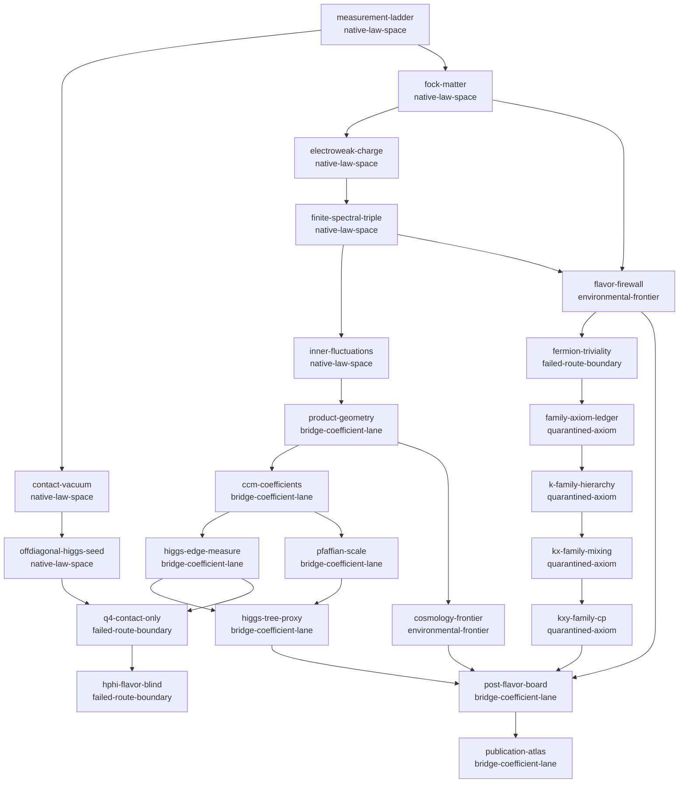

# Gate 420 Registry Audit — Publication-Grade Theorem Atlas / Dependency Graph Export

## Claim tested

Export the Gate-419 post-flavor ASHA law-space board into a peer-reviewable theorem atlas and dependency graph. Gate 420 is an artifact/export gate: it adds no physics claim, predicts no flavor coefficient, and promotes no quarantined axiom.

## Gate 419 inheritance

G419=true G418FlavorSeal=true nativeFlavorDim=13 conditionalFamilyDim=9 noFlavorReopening=true verdict=Gate 420 inherits the Gate-419 final law-space board and exports it as an atlas without reopening flavor.

## Atlas summary

nodes=23 edges=28 native=7 bridge=7 quarantined=4 environmental=2 failed=3 acyclic=true verdict=publication theorem atlas compiled as an acyclic dependency graph with all firewalls preserved

| ID | Layer | Gates | Package | Status | Dependencies | Claim | Boundary |
|---|---|---|---|---|---|---|---|
| `measurement-ladder` | native-law-space | G0, G1, G2 | `pkg/clifford + pkg/exterior` | verified |  | finite algebraic grammar | not spacetime by itself |
| `contact-vacuum` | native-law-space | G3, G4, G5, G6 | `pkg/geometry/contact + pkg/dynamics/bsector` | verified | measurement-ladder | K₇ selected as exact finite zero-mode contact vacuum | no physical mass unit |
| `offdiagonal-higgs-seed` | native-law-space | G10, G11, G12, G37 | `pkg/gauge/higgs + pkg/dynamics/scalarpotential` | verified | contact-vacuum | Higgs-like scalar/contact response and potential shape | not flavor selector |
| `fock-matter` | native-law-space | G13, G17, G18, G19 | `pkg/matter/*` | verified | measurement-ladder | Λ*(C⁴) matter bookkeeping and Yukawa selection arena | generation not derived |
| `electroweak-charge` | native-law-space | G23, G24, G25, G26, G41 | `pkg/matter/hypercharge + pkg/matter/su2l` | verified | fock-matter | Y, Q, SU(2)L ladder, kY=5/3, sin²θ*=3/8 | low-energy running remains bridge |
| `finite-spectral-triple` | native-law-space | G272, G274, G295, G296, G297 | `pkg/bridge/finitespectraltriple + bimodule packages` | verified | electroweak-charge | A_F=C⊕H⊕M₃(C), J, D_F, first-order structure | family bundle not derived |
| `inner-fluctuations` | native-law-space | G298, G299 | `pkg/bridge/*inner*` | verified | finite-spectral-triple | SM gauge inventory plus one Higgs doublet | not Yukawa amplitudes |
| `product-geometry` | bridge-coefficient-lane | G376, G377, G379 | `pkg/bridge/almostcommutativeproduct` | bridge | inner-fluctuations | finite law-space embedded into product spectral action | continuum coefficient conventions explicit |
| `ccm-coefficients` | bridge-coefficient-lane | G379, G380, G381, G382 | `pkg/bridge/ccmspectralactionsubstitution` | bridge | product-geometry | coefficient arithmetic lane consolidated | convention-sensitive bridge |
| `higgs-edge-measure` | bridge-coefficient-lane | G383, G384, G385 | `pkg/bridge/innerfluctuationedgemeasure` | bridge | ccm-coefficients | edge-supported Higgs kinetic/measure ledger | not full loop phenomenology |
| `pfaffian-scale` | bridge-coefficient-lane | G341, G342, G343, G380 | `pkg/bridge/pfaffianhierarchy + gravityspectralactionf2` | bridge | ccm-coefficients | scale hierarchy lane organized | depends on bridge assumptions |
| `higgs-tree-proxy` | bridge-coefficient-lane | G380, G384, G385, G387 | `pkg/bridge/ashafinalarchitectureledger` | bridge | higgs-edge-measure, pfaffian-scale | tree proxy board consolidated | not loop-corrected pole prediction |
| `flavor-firewall` | environmental-frontier | G345, G361, G372, G374, G387 | `pkg/bridge/nativemodulispacecensus + closing theorem` | sealed | finite-spectral-triple, fock-matter | native charged flavor moduli remain 13 | Yukawa values environmental |
| `q4-contact-only` | failed-route-boundary | G398, G399, G400, G401, G402, G403, G404, G405, G406 | `pkg/bridge/contacteigenoperatorreconstruction` | failed-route-index | offdiagonal-higgs-seed, higgs-edge-measure | q4 is native contact invariant only | not Hphi selector |
| `hphi-flavor-blind` | failed-route-boundary | G407, G408 | `pkg/bridge/hphinativescalaralgebra + hphivariationalselector` | failed-route-index | q4-contact-only | Hphi has capacity but no canonical flavor selector | flavor blind under native functionals |
| `fermion-triviality` | failed-route-boundary | G409, G410 | `pkg/bridge/fermionicgenerationorigin + fermionicfamilybundleextension` | failed-route-index | flavor-firewall | current fermion carrier keeps U(3)gen triviality | no native family bundle |
| `family-axiom-ledger` | quarantined-axiom | G411 | `pkg/bridge/familybundleaxiomledger` | quarantined | fermion-triviality | minimal new axioms ranked | no axiom native |
| `k-family-hierarchy` | quarantined-axiom | G412 | `pkg/bridge/minimalmodularfamilyhamiltonian` | quarantined | family-axiom-ledger | K_gen gives hierarchy capacity | diagonal only |
| `kx-family-mixing` | quarantined-axiom | G413, G414, G415, G416 | `pkg/bridge/noncommutingmodularpair + minimalsectorsourceaxiom` | quarantined | k-family-hierarchy | K/X gives real mixing capacity and six real charged coefficients | coefficients free; no CP phase |
| `kxy-family-cp` | quarantined-axiom | G417, G418 | `pkg/bridge/complexsectorsourcephase + familyaxiomclosureledger` | quarantined | kx-family-mixing | K/X/Y gives CP-capable nine-coefficient source ledger | nine coefficients environmental |
| `cosmology-frontier` | environmental-frontier | G344, G375, G386, G387 | `pkg/bridge/cosmologicalobservables*` | sealed | product-geometry | cosmology separated from finite law-space | requires historical/environmental data |
| `post-flavor-board` | bridge-coefficient-lane | G419 | `pkg/bridge/postflavorarchitectureboard` | ready | higgs-tree-proxy, flavor-firewall, kxy-family-cp, cosmology-frontier | final law-space board compiled | no new physics claim |
| `publication-atlas` | bridge-coefficient-lane | G420 | `pkg/bridge/publicationtheorematlas` | ready | post-flavor-board | dependency graph and theorem atlas exported | export only; no theorem promotion |

## Dependency graph exports

mermaid=true dot=true markdown=true machineLedger=23 ready=true verdict=markdown, mermaid, DOT, and machine-readable ledgers exported

### Mermaid

### DOT

```dot
digraph ASHA_Gate420_Atlas {
  rankdir=LR;
  "measurement-ladder" [label="measurement-ladder\nnative-law-space"];
  "contact-vacuum" [label="contact-vacuum\nnative-law-space"];
  "offdiagonal-higgs-seed" [label="offdiagonal-higgs-seed\nnative-law-space"];
  "fock-matter" [label="fock-matter\nnative-law-space"];
  "electroweak-charge" [label="electroweak-charge\nnative-law-space"];
  "finite-spectral-triple" [label="finite-spectral-triple\nnative-law-space"];
  "inner-fluctuations" [label="inner-fluctuations\nnative-law-space"];
  "product-geometry" [label="product-geometry\nbridge-coefficient-lane"];
  "ccm-coefficients" [label="ccm-coefficients\nbridge-coefficient-lane"];
  "higgs-edge-measure" [label="higgs-edge-measure\nbridge-coefficient-lane"];
  "pfaffian-scale" [label="pfaffian-scale\nbridge-coefficient-lane"];
  "higgs-tree-proxy" [label="higgs-tree-proxy\nbridge-coefficient-lane"];
  "flavor-firewall" [label="flavor-firewall\nenvironmental-frontier"];
  "q4-contact-only" [label="q4-contact-only\nfailed-route-boundary"];
  "hphi-flavor-blind" [label="hphi-flavor-blind\nfailed-route-boundary"];
  "fermion-triviality" [label="fermion-triviality\nfailed-route-boundary"];
  "family-axiom-ledger" [label="family-axiom-ledger\nquarantined-axiom"];
  "k-family-hierarchy" [label="k-family-hierarchy\nquarantined-axiom"];
  "kx-family-mixing" [label="kx-family-mixing\nquarantined-axiom"];
  "kxy-family-cp" [label="kxy-family-cp\nquarantined-axiom"];
  "cosmology-frontier" [label="cosmology-frontier\nenvironmental-frontier"];
  "post-flavor-board" [label="post-flavor-board\nbridge-coefficient-lane"];
  "publication-atlas" [label="publication-atlas\nbridge-coefficient-lane"];
  "measurement-ladder" -> "contact-vacuum";
  "contact-vacuum" -> "offdiagonal-higgs-seed";
  "measurement-ladder" -> "fock-matter";
  "fock-matter" -> "electroweak-charge";
  "electroweak-charge" -> "finite-spectral-triple";
  "finite-spectral-triple" -> "inner-fluctuations";
  "inner-fluctuations" -> "product-geometry";
  "product-geometry" -> "ccm-coefficients";
  "ccm-coefficients" -> "higgs-edge-measure";
  "ccm-coefficients" -> "pfaffian-scale";
  "higgs-edge-measure" -> "higgs-tree-proxy";
  "pfaffian-scale" -> "higgs-tree-proxy";
  "finite-spectral-triple" -> "flavor-firewall";
  "fock-matter" -> "flavor-firewall";
  "offdiagonal-higgs-seed" -> "q4-contact-only";
  "higgs-edge-measure" -> "q4-contact-only";
  "q4-contact-only" -> "hphi-flavor-blind";
  "flavor-firewall" -> "fermion-triviality";
  "fermion-triviality" -> "family-axiom-ledger";
  "family-axiom-ledger" -> "k-family-hierarchy";
  "k-family-hierarchy" -> "kx-family-mixing";
  "kx-family-mixing" -> "kxy-family-cp";
  "product-geometry" -> "cosmology-frontier";
  "higgs-tree-proxy" -> "post-flavor-board";
  "flavor-firewall" -> "post-flavor-board";
  "kxy-family-cp" -> "post-flavor-board";
  "cosmology-frontier" -> "post-flavor-board";
  "post-flavor-board" -> "publication-atlas";
}
```

## Topological order

1. `measurement-ladder`
2. `contact-vacuum`
3. `fock-matter`
4. `electroweak-charge`
5. `finite-spectral-triple`
6. `flavor-firewall`
7. `fermion-triviality`
8. `family-axiom-ledger`
9. `inner-fluctuations`
10. `k-family-hierarchy`
11. `kx-family-mixing`
12. `kxy-family-cp`
13. `offdiagonal-higgs-seed`
14. `product-geometry`
15. `ccm-coefficients`
16. `cosmology-frontier`
17. `higgs-edge-measure`
18. `pfaffian-scale`
19. `higgs-tree-proxy`
20. `post-flavor-board`
21. `publication-atlas`
22. `q4-contact-only`
23. `hphi-flavor-blind`

## Firewall ledger

firewalls=3 flavor=true cosmology=true noEmpirical=true verdict=frontier firewalls exported and preserved

| Firewall | Native dim | Conditional dim | Status | Preserved | Coordinates | Claim |
|---|---:|---:|---|---:|---|---|
| charged flavor | 13 | 9 | `FIREWALL_PRESERVED_13_MODULI` | true | charged masses, CKM angles, CKM CP phase, source coefficients | native ASHA keeps 13 charged moduli; K/X/Y gives conditional nine-coefficient capacity only |
| cosmology/dark sector | -1 | -1 | `FAILED_ROUTE_NO_COSMOLOGY_PREDICTION` | true | rho_Lambda, Omega_DM, baryogenesis history, subtraction rule | cosmological observables remain environmental/history dependent |
| family axioms | 0 | 9 | `FAILED_ROUTE_NO_QUARANTINED_AXIOM_PROMOTED_TO_NATIVE` | true | K_gen, X_gen, Y_gen, sector coefficients | K/X/Y chain is capacity axiom, not native theorem |

## Failed-route index

routes=5 scalar=2 fermion=2 familyAxiom=1 indexed=true verdict=failed-route boundaries indexed for publication

| Gate range | Route | Reason | Lesson |
|---|---|---|---|
| G393-G397 | triality/contact generation functors | no native generation-address functor into finite Dirac carrier | threefold structure is not automatically generation |
| G398-G406 | q4 to Hphi/scalar/edge identification | q4 is internal contact-sector invariant only | do not force cross-sector polynomial identity |
| G407-G408 | Hphi native variational selector | native scalar observables are central or pair-degenerate; full End capacity lacks selector | Higgs sector is flavor-blind |
| G409-G410 | fermionic carrier and representation extensions | current matter carrier keeps trivial U(3) family multiplicity | nontrivial family bundle requires axiom |
| G412-G417 | family axiom coefficient selection | K/X/Y gives capacity but coefficients remain free | capacity does not predict values |

## Result statuses

- `CONDITIONAL_SUPPORT_GATE419_FINAL_BOARD_INHERITED`
- `CONDITIONAL_SUPPORT_PUBLICATION_THEOREM_ATLAS_COMPILED`
- `CONDITIONAL_SUPPORT_DEPENDENCY_GRAPH_EXPORTED`
- `CONDITIONAL_SUPPORT_ATLAS_GRAPH_ACYCLIC`
- `CONDITIONAL_SUPPORT_LAYER_CLASSIFICATION_PRESERVED`
- `CONDITIONAL_SUPPORT_FAILED_ROUTES_INDEXED`
- `CONDITIONAL_SUPPORT_FIREWALLS_EXPORTED`
- `CONDITIONAL_SUPPORT_NO_NEW_PHYSICS_CLAIM_IN_GATE420`
- `PROJECT_PUBLICATION_THEOREM_ATLAS_READY`
- `FAILED_ROUTE_NO_NEW_DERIVATION_IN_GATE420`
- `FAILED_ROUTE_NO_YUKAWA_COEFFICIENT_PREDICTION`
- `FAILED_ROUTE_NO_COSMOLOGY_PREDICTION`
- `FAILED_ROUTE_NO_QUARANTINED_AXIOM_PROMOTED_TO_NATIVE`
- `FAILED_ROUTE_NO_FLAVOR_REOPENING_IN_GATE420`
- `FIREWALL_PRESERVED_13_MODULI`

## Final status

atlasReady=true acyclic=true firewalls=true noNewPhysics=true noAxiomPromotion=true nativeFlavorDim=13 conditionalFamilyDim=9 status=PROJECT_PUBLICATION_THEOREM_ATLAS_READY verdict=Gate 420 exports a peer-reviewable theorem atlas and preserves all prior boundaries.

## Next gate

Gate 421 — Manuscript Skeleton / Section-by-Section Proof Export: Gate 420 produces the theorem atlas; the next useful move is a manuscript/report skeleton that turns the atlas into publication sections.

## Truth statement

Gate 420 exports the ASHA theorem atlas as an acyclic, publication-grade dependency graph. It adds no new physics claim, promotes no family axiom, predicts no Yukawa coefficient, and preserves the charged flavor and cosmology firewalls.
